# AGENT_SESSION.md

Living work-tracking document for Claude Code sessions on this repo.

- **Companion to** [`AGENT.md`](AGENT.md) — that file describes the *design*; this file tracks
  *state, findings, and what to do next*.
- **Convention:** append to the Session Log at the bottom each session. Update the checkboxes
  in the Roadmap. Move items out of the Bug Register when fixed (note the commit).
- **Last updated:** 2026-09-21 (session 6b)
- **For a supervisor-facing summary** (status, structure, open issues, next steps) see
  [`PROJECT_STATUS.md`](PROJECT_STATUS.md) — this file is the detailed engineering log behind it.

---

## 1. Project in one paragraph

Lab project (9 ECTS, supervisor Niklas Mueller-Goldingen): a **Unitree Go1** quadruped with a
**ROBOTIS OpenManipulator-X** arm and **Intel RealSense D455** must navigate to a table, let a
user pick an object via GUI on the camera feed, reconstruct that object from multiple viewpoints,
and grasp it. Validate in **Isaac Sim 4.5** first, then deploy on the real robot.
Source of truth: `docs/lab_project_quadruped_260805_065836.pdf`.

### Work-package ownership

| WP | Scope | Owner | State |
|----|-------|-------|-------|
| WP1 | Navigation + user GUI for object selection | teammate | not in this repo |
| WP2 | Multi-view RGB-D capture + point-cloud fusion | teammate (partially us now — see below) | not in this repo — hands us `scene.pcd` + `object.pcd`; base-placement math for reaching a capture/grasp pose is now built on our side, see session 4 |
| WP3 | Grasp pose estimation + MoveIt planning + execution | **us** | detection works, execution does not |
| WP4 | Isaac Sim validation, real-robot transfer, metrics | shared | plumbing only, no metrics; **quadruped locomotion (a WP1/WP4-adjacent piece) now has real code, see session 4** |

> ⚠️ **Unconfirmed:** WP ownership above is inferred from `AGENT.md` decision #1 (teammate supplies
> both clouds, already in `camera_link`). Confirm with the team before planning further.
>
> ⚠️ **Robot identity mismatch, found session 4:** the lab brief (`docs/lab_project_quadruped_260805_065836.pdf`)
> specifies a **Unitree Go1**. The new `spot_policy_control` package (see §4, §8) implements a
> locomotion controller for **Boston Dynamics Spot**, not Go1, while `grasp_pipeline/base_teleport.py`
> still names its topic `/go1/move_relative` even though nothing underneath currently drives a Go1.
> Unclear whether this is a deliberate pivot (confirm with supervisor — the brief names Go1
> specifically) or a stand-in built against whichever quadruped asset was available in Isaac Sim.
> Resolve before this feeds into any WP4 reporting.

---

## 2. Machine context

This repo is now worked on from **three different machines**. Knowing which one you are on
matters, because almost nothing runs on the laptop, and the two GPU machines are independent
(different institution, different network, different license seat).

| | `jannen-ThinkPad` (local) | GPU PC / H-BRS lab (original sim machine) | `pringles` (Uni Bonn Informatik GPU box) |
|---|---|---|---|
| Role | editing, git, docs | Isaac Sim, AnyGrasp inference, containers | Isaac Sim, AnyGrasp inference, containers |
| User | — | `studentkelo` | `monisi1` |
| Host | — | `192.168.0.103` (private, behind lab router) | `pringles.informatik.uni-bonn.de` — `131.220.7.222` (**public/routable**) |
| GPU | no usable GPU | yes | yes — RTX 4080 SUPER |
| Isaac Sim 4.5 | no | yes — **requires NVIDIA driver 580**; driver 595 crashes it | yes — driver confirmed `580.173.02` ✅ |
| `sudo` | — | no admin password | no admin password (`sudo -n` prompts) |
| `docker` group | — | assumed | confirmed ✅ |
| Docker containers | no | `anygrasp_display`, `ros_noetic` (unconfirmed since last session) | `anygrasp_display`, `ros_noetic` both running ✅ |
| AnyGrasp license | invalid (node-locked elsewhere) | valid (assumed) | valid — `Imanish2.lic/.public_key/.signature` present ✅ |
| `checkpoint_detection.tar` | absent | expected at `/workspace/checkpoint_detection.tar` | present at `~/anygrasp_docker/checkpoint_detection.tar` ✅ |

⚠️ **Open question (unresolved this session):** is `pringles` a second, independent GPU resource,
or does it replace the H-BRS machine as *the* GPU PC going forward? Confirm with the team —
until then, treat the two GPU rows above as two separate machines, not two names for one machine.

**Current approach:** work over SSH into whichever GPU machine is in play rather than rebuilding
locally. `pringles` has a **public IP**, so — unlike the H-BRS machine — it may not need any of
the tunnel/VPN workarounds below at all; a plain `ssh monisi1@pringles.informatik.uni-bonn.de`
from home should just work once a key is installed. Still unverified from an actual off-campus
connection.

### Remote access — H-BRS lab machine (as of 2026-08-07)

The GPU PC **is** the lab machine already in `~/.ssh/config` on the ThinkPad:

```
Host 192.168.0.103
  HostName 192.168.0.103
  ForwardX11 no
  User studentkelo
```

- `sshd` is already running on it. ✅
- **We have no admin/sudo password on the lab machine.** Rules out: installing AnyDesk, any
  system-wide daemon, router port-forwarding, and system `systemd` units. A user `@reboot`
  crontab is the no-root way to persist anything.
- ⚠️ **The reachability problem:** `192.168.0.103` is a private address behind the lab router.
  An SSH *key* solves authentication, not routing — from home there is no path to that address
  at all. Working from home therefore needs one of:

| Route | Admin? | Catch |
|---|---|---|
| University VPN, then `ssh 192.168.0.103` direct | no | only if the VPN routes into `192.168.0.0/24`; a `192.168.0.x` subnet usually means a *lab-owned* router the uni VPN won't reach |
| Reverse SSH tunnel: lab → `cluster.h-brs.de` (account `jthyri2s`, already in ssh config as `GPU_cluster_hbrs`), connect back through it | no | needs `AllowTcpForwarding` on the cluster + a keep-alive across reboots |
| Cloudflare Tunnel (`cloudflared` unprivileged binary in `$HOME`) | no | free Cloudflare account + outbound internet on the lab machine |

Note: the laptop was on `172.20.10.5/28` (phone hotspot) during the audit, so it had no LAN
path to the lab machine at that time.

None of the three routes above have been tested yet — the `cluster.h-brs.de` reachability test
run this session (§8, 2026-08-07 second entry) was executed **from `pringles`**, a different
network entirely, not from the H-BRS lab machine, so it doesn't answer the reverse-tunnel
question for *this* table. That test still needs to run **on** `192.168.0.103` per Step 0a below.

### Remote access — `pringles` (as of 2026-08-07)

No tunnel needed so far: `pringles.informatik.uni-bonn.de` resolves to a public IP
(`131.220.7.222`) and presumably accepts inbound SSH directly (`PasswordAuthentication yes` in
`sshd_config`). Not yet verified from an actual off-campus network — do that before relying on it.

One data point gathered *from* `pringles`, for a different question: `cluster.h-brs.de` does not
resolve on this network at all (`ssh: Could not resolve hostname`). Uni Bonn's network apparently
has no path to H-BRS's cluster — irrelevant to reaching `pringles` itself, but rules out using
`pringles` as a hop toward the H-BRS machine via that cluster.

### ⚠️ `ws_moveit_clean` is now a *third*, separate copy of the code (found session 4)

The "two copies, not one bind mount" gotcha from session 3 (§8, Arc 2) has grown a third leg.
`~/ws_moveit_clean` on `pringles` (bind-mounted into the `ros_noetic` container at
`/root/ws_moveit`) is its **own git repository**, with its own single-commit history
(`54d64fe First commit`), entirely independent of this repo's (`quadruped-atHome`) commit
history. It is **not** a clone of, or remote-linked to, `quadruped-atHome` — the two only agree
because someone copied files across at some point.

As of this session, `ws_moveit_clean` has drifted ahead of `quadruped-atHome`'s `nav/` tree:
- `src/grasp_pipeline/` and `src/spot_policy_control/` exist only in `ws_moveit_clean`, and are
  themselves **uncommitted** there too (`git status` shows both as untracked `??`). They exist
  nowhere in version control right now — only on `pringles`'s disk.
- `src/grasp_pipeline/scripts/tf_utils.py` differs from `quadruped-atHome`'s committed
  `nav/grasp_pipeline/scripts/tf_utils.py` in ways that look like an unfinished experiment (see
  the new bug entry in §5) — `ROTATION_OFFSET_QUATERNION` and `GRASP_POSITION_CORRECTION` have
  different values in each copy.

**Practical implication:** don't trust `quadruped-atHome`'s `nav/grasp_pipeline/` as the current
state of that code — `ws_moveit_clean` on `pringles` is ahead of it and is where live testing
actually happens. Until someone reconciles the two (push `ws_moveit_clean` to a remote, or copy
its current state back into this repo and commit), a fresh checkout of `quadruped-atHome` will
build and run, but will **not** reflect the actual, currently-tested WP3 code or include
`spot_policy_control`/`base_teleport.py` at all.

---

## 3. Architecture as actually built

Two deliberately isolated containers, talking over HTTP. The AnyGrasp container holds a
**node-locked license**, so it must not be rebuilt — hence no ROS inside it, and REST as the
boundary. As of session 3, the WP3 chain that used to say `[MISSING: ...]` here is fully built
and has been run for real (not just unit-tested) against Isaac Sim's live simulated camera — see
§4 and §8 for exactly what that run did and didn't prove.

```mermaid
flowchart TD
    subgraph Isaac["Isaac Sim 4.5 (isaacsim.exp.full.kit process)"]
        Cam["Simulated RealSense D455<br/>depth + color + camera_info @ 30Hz"]
        Phys["Physics: ArticulationController<br/>joint1-4, gripper_left/right"]
        AG["ActionGraph: On Playback Tick,<br/>Publish/Subscribe Joint State,<br/>Publish Clock, ROS1 Camera Helper x2"]
    end

    subgraph ROS["ros_noetic container (ROS1 Noetic, --network host)"]
        Bridge["/OmniIsaacRosBridge"]
        RSP["robot_state_publisher"]
        MG["move_group<br/>(IsaacControllerManager plugin)"]
        TB["trajectory_bridge.py<br/>(open_manipulator_control)"]
        LC["live_capture.py"]
        GC["grasp_client.py"]
        TU["tf_utils.py"]
        GP["grasp_planner.py"]
        EX["executor.py"]
    end

    subgraph AGBox["anygrasp_display container (NO ROS, node-locked license)"]
        Server["server.py (Flask)"]
        Pipe["loader.py &#8594; mask.py (kD-tree) &#8594; detector.py (GSNet)"]
    end

    Cam -- "/camera/depth/image_raw<br/>/camera/color/camera_info" --> Bridge
    AG -- "/joint_states, /clock" --> Bridge
    Bridge --> RSP
    RSP -- "/tf (incl. camera_optical_frame)" --> TU

    Bridge -.depth+intrinsics.-> LC
    LC -- "scene.pcd + object.pcd<br/>(box-mask placeholder for WP1)" --> GC
    GC -- "HTTP POST /predict" --> Server
    Server --> Pipe
    Pipe -- "JSON: grasps[] top-K" --> GC
    GC --> GP
    TU -- "camera&#8594;link1 TF + rotation<br/>offset + empirical position fudge" --> GP
    GP -- "pregrasp_pose, grasp_pose" --> EX
    EX -- "moveit_commander" --> MG
    MG -- "/joint_trajectory" --> TB
    TB -- "/joint_command" --> Bridge
    Bridge --> Phys
    Phys -.moves.-> Cam
```



Everything left of `AGBox` and everything inside `ROS` is **us (WP3)**. `Isaac` is the
simulation stand-in for the real robot/camera (WP4's job to eventually swap for hardware).
`teammate → scene.pcd/object.pcd` (WP2) doesn't exist yet — `live_capture.py` is a stand-in that
captures the *same* two files locally from Isaac's simulated camera instead of receiving them
from a teammate, specifically so WP3 could be tested in isolation without waiting on WP1/WP2.

### Robot model facts
- MoveIt groups: `x_arm` (`joint1`–`joint4`), `hand` (`gripper_left_joint`).
- Named states: `stand_up`, `Rest` (`joint1=-π`, a 180° stowed pose, not near-zero — confirmed by
  actually landing there, see §8), `Grip_Open`, `Grip_Close` (`config/open_manipulator_x.srdf`).
- Isaac expects **6** joints incl. `gripper_right_joint` (see `joint_command_test.py:45`),
  but the `hand` controller only drives `gripper_left_joint` → right finger must be mirrored.
- Root frame is `world`, first link `link1` (virtual fixed joint, origin `0 0 0`).
- `camera_link`/`camera_optical_frame` were **entirely commented out** in
  `open_manipulator_x.urdf.xacro` until session 3 — `camera_link` did not exist in the TF tree at
  all before then. Now uncommented, plus a `camera_optical_joint` rotation fix — see BUG-13.
- **`end_effector_link`, `gripper_left_link`, and (pre-fix) `camera_link` all share `link5`'s exact
  orientation** — their mount joints are `rpy="0 0 0"`. The gripper's approach axis is local **+X**
  (AnyGrasp's own convention too — see `tf_utils.py`'s docstring). A camera's optical convention
  expects forward along local **+Z** — a *different* axis of the same unrotated frame. Pitching the
  gripper down does not pitch the camera down; see BUG-13.

---

## 4. Component status

### `detection/anygrasp_pipeline/` — inference service
| File | State |
|---|---|
| `loader.py` | ✅ complete — PCD → Open3D → numpy |
| `mask.py` | ✅ complete — kD-tree nearest-neighbour object mask, `(N,)` bool over `scene.points` |
| `visualize.py` | ✅ complete — Open3D cloud + top-20 grippers |
| `detector.py` | ✅ fixed session 3 — `predict()` returns the sorted `GraspGroup` (BUG-1/2 fixed), paths from `config.py` (BUG-4 fixed) |
| `server.py` | ✅ fixed session 3 — `/predict` returns a `top_k`-configurable `grasps[]` array; tested live against `example_data`, returns real grasps with no errors |
| `main.py` | ✅ fixed session 3 — uses the scene+mask `predict()` path, matching `server.py` (BUG-3 fixed) |
| `config.py` | ✅ fixed session 3 — paths/thresholds/defaults, all env-var overridable |
| `transforms.py` | ⚠️ still dead code, still wrong container (BUG-7) — **not touched this session** |

### `nav/` — ROS workspace (note: contains **no navigation**, it is the manipulation ws)
| Package | State |
|---|---|
| `X_moveit_config/` | ✅ full Setup Assistant output, OMPL/CHOMP/STOMP/Pilz pipelines. `fake_moveit_controller_manager.launch.xml` now also starts `trajectory_bridge` (session 3 fix, see §8) |
| `moveit_isaac_controller_manager/` | ⚠️ still fire-and-forget (BUG-5) — **directly observed causing a real failure this session**, see §8 |
| `open_manipulator_control/` | ⚠️ `trajectory_bridge.py` works, now actually launched, but still blocks + no interpolation (BUG-6) — unchanged |
| `grasp_pipeline/` | ✅ built session 3 — `grasp_client.py`, `tf_utils.py`, `grasp_planner.py`, `executor.py`, plus `live_capture.py` (not originally planned — see §3's note on why). ⚠️ session 4: `ws_moveit_clean`'s live copy has since added `base_teleport.py` and modified `tf_utils.py`, uncommitted anywhere — see the machine-context note in §2 and the new bug in §5 |
| `spot_policy_control/` (new, session 4) | ⚠️ new package, found only in the live `ws_moveit_clean` copy, **uncommitted**. RL locomotion controller for a **Boston Dynamics Spot** in Isaac Sim (`/cmd_vel`, closed-loop `/spot/move_relative`, zero-velocity stance lock, watchdog auto-stop), with its own `AGENT.md` documenting a host/`ros_noetic`-container split. Ships a runbook (`README.md`) and architectural-invariants doc. Not wired into MoveIt/grasp execution yet ("prepared for future arm mounting"). See the Go1-vs-Spot flag in §1 |

`scene_receiver.py` (publish `scene.pcd` into the MoveIt planning scene for collision awareness)
is still genuinely absent — nothing publishes captured geometry as a collision object yet, so
`executor.py`'s `attach_object()` call is a no-op until this exists.

### `grasp_pipeline/base_teleport.py` — mobile-base placement (new, session 4)
Not in the git repo yet (see §2's third-copy note) — found only in `ws_moveit_clean` on `pringles`.
Computes where the mobile base should move so the arm's reachable sagittal pitch plane aligns with
an AnyGrasp approach vector (`compute_base_placement`), publishes `(dx, dy, dtheta)` to
`/go1/move_relative` and a debug topic, and includes a `BaseTeleporter` that broadcasts a dynamic
`world → link1` TF for testing base repositioning in sim without a real base controller underneath.
It's genuinely wired in — imported by both `grasp_planner.py` and `executor.py`, not a dead stub.
This is effectively new WP2-adjacent scope (arm/base coordination) that wasn't previously ours —
see the WP2 row in §1. Untested against `spot_policy_control`'s actual Spot locomotion as of this
session; the topic name (`/go1/...`) and the underlying controller (Spot) don't currently match.

---

## 5. Bug / defect register

Filed by code read on 2026-08-07 (session 1). Status updated session 3 — most of Step 1's bugs
are now fixed; see the entries themselves for what "fixed" actually means here (in the git repo
and the *live* container path both — see §8's note on the two-copies gotcha).

### Fixed this session

**BUG-1 / BUG-2 — `/predict` endpoint raised; wrapper contract violated. ✅ Fixed.**
`detector.predict()` no longer collapses to a single wrapped `GraspResult` (no `__len__`, no
`__getitem__`, wrong attribute name). It now returns the sorted `GraspGroup` per `AGENT.md`
decision #5 (caller picks best/top-K), with the empty-check happening *before* any indexing.
`server.py` picks the top-K itself via a new `top_k` form param (default from `config.py`).
Verified live: `/predict` against `example_data` returns real grasps, HTTP 200, no errors.

**BUG-3 — inference ignored the scene. ✅ Fixed.**
`main.py` now calls `detector.predict(scene.points, region_mask=mask, collision_detection=True)`,
matching what `server.py` already did. `predict_all()` is kept as an explicitly-documented
no-mask/no-collision simple mode, not silently wrong.

**BUG-4 — hardcoded container paths. ✅ Fixed.**
Moved into `config.py` (previously empty) with env-var overrides: `ANYGRASP_SDK_PATH`,
`ANYGRASP_CHECKPOINT_PATH`, `ANYGRASP_MAX_GRIPPER_WIDTH`, `ANYGRASP_GRIPPER_HEIGHT`,
`ANYGRASP_MASK_THRESHOLD`, `ANYGRASP_TOP_K`.

**BUG-8 — syntax error in committed file. ✅ Fixed.**
Deleted `detection/anygrasp/grasp_detection/anygrasp_service.py` (`return gg[19okay]`) from both
the git repo and the live SDK copy. Never imported anywhere.

**Missing `trajectory_bridge` launch — root cause of "MoveIt plans succeed, robot never moves". ✅ Fixed.**
Not in the original register (found live, not by code read): `trajectory_bridge.py` existed but
was never referenced by any launch file — `IsaacControllerManager` published trajectories to
`/joint_trajectory` with zero subscribers, and nothing ever reached Isaac's `/joint_command`.
Fixed by adding it as a `<node>` in `fake_moveit_controller_manager.launch.xml`. Committed on
branch `fix/trajectory-bridge-launch` (`5799a35`), **merged to `main`** (`1edcb8c`) — confirmed via
`git log` session 4, superseding this entry's earlier "not yet merged" note.

### New bugs found this session

**BUG-13 — camera optical frame's forward axis doesn't align with the gripper's approach axis.**
`camera_joint` and `camera_optical_joint` were both `rpy="0 0 0"` relative to `link5`/`camera_link`
— meaning `camera_optical_frame`'s axes point in *exactly* the same directions as `link5`'s own
axes, unrotated. The gripper's approach direction is `link5`'s local **+X** (matches AnyGrasp's own
convention, see `tf_utils.py`), but a camera's optical "forward" is conventionally local **+Z** — a
different, perpendicular axis of the same frame. Pitching the arm to point the gripper down does
**not** point the camera down; they're offset by roughly 90°. **Partially fixed:** added
`rpy="0 1.5707963 0"` to `camera_optical_joint`, remapping optical +Z onto link5's +X. Verified
by directly transforming live captured depth data into `link1` frame before/after the fix, against
a cube of known position — grasp-position error dropped from ~35cm (landed *above* the camera
itself — clearly wrong) to ~10cm. Real, measured improvement, not just derived on paper — but see
BUG-14, there's a second, smaller error still unaccounted for.

**BUG-14 — residual ~10cm camera mount offset, empirically patched, not really fixed.**
Even after BUG-13's fix, a captured object's measured centroid (transformed through TF into
`link1`) still landed ~10cm off from ground truth (a cube at a known logged position), with the
error concentrated in Y/Z, X was nearly perfect. Most likely cause: the ROS URDF assumes the
camera mounts at `xyz="0.04 0.00 0.05"` relative to `link5` (`camera_joint`), but Isaac Sim's
actual USD camera prim was authored directly in the scene and never round-tripped back into this
URDF — if Isaac's real mount differs from that assumed offset by a few cm, this is exactly what
you'd see. **Patched, not fixed:** `tf_utils.py`'s `GRASP_POSITION_CORRECTION` subtracts the one
measured error vector as a constant `link1`-frame translation. This is an explicit fudge,
calibrated at ONE arm pose — if the true cause is camera-local (the likely case), the correction
will drift as the arm's orientation changes. Real fix: read Isaac's actual
`camera_link`/`RSD455` prim Translate/Orient directly from the Stage tree's Property panel and put
the *true* offset into `camera_joint`'s `xyz`/`rpy`, replacing the fudge entirely. Not done this
session — added to the roadmap.

**BUG-5 — execution is fire-and-forget. ⭐ highest impact. Confirmed directly this session, still open.**
`isaac_controller.cpp:27` reports `SUCCEEDED` immediately and `waitForExecution`
(`isaac_controller.cpp:41-48`) just sleeps the timeout and returns true. MoveIt therefore believes
every motion finishes instantly while `trajectory_bridge.py` is still replaying waypoints. Any
multi-step grasp (approach → close → retreat) issues each step before the previous one has moved.
**Nothing in WP3 will work reliably until execution has real feedback.**
**Directly observed this session, not just theorized:** commanded `joint2` from `-0.29` to `-0.05`
via `moveit_commander.go(wait=True)`, which returned `True` (success) — but `/joint_states` showed
`joint2` frozen at `-0.265`, stable and unmoving for 6+ seconds afterward, 0.21 rad short of the
target. The only reliable way found to confirm a move actually landed was to check `/joint_states`
independently after every `go()` call, never trust its return value alone.

**BUG-6 — bridge blocks and under-samples.** `trajectory_bridge.py:31` calls `rospy.sleep` inside the
subscriber callback → a new trajectory cannot pre-empt a running one. It republishes only the sparse
waypoints with no interpolation (jerky in Isaac), and does not mirror `gripper_left_joint` onto
`gripper_right_joint`.

**BUG-7 — `transforms.py` is dead and misplaced.** Never imported. Expects raw AnyGrasp grasp objects
(`.rotation_matrix`), not `GraspResult`. Since the REST boundary returns JSON and the design puts
TF on the ROS side, this logic belongs in `grasp_pipeline`, not the AnyGrasp container.

**BUG-9 — `fake` silently means Isaac.** `launch/fake_moveit_controller_manager.launch.xml` was edited
to load `moveit_isaac_controller_manager/IsaacControllerManager`. It works (`demo.launch` defaults to
`fake`), but the name lies and `fake_controllers.yaml` still carries `type:` / `initial:` keys the
Isaac plugin ignores. Should become `isaac_moveit_controller_manager.launch.xml` +
`isaac_controllers.yaml`, with the real fake one restored.

**BUG-10 — octomap sensor is a PR2 leftover.** `config/sensors_3d.yaml` points at
`/head_mount_kinect/depth_registered/image_raw`. Collision awareness from the depth camera is
therefore dead; must point at the RealSense D455 topic.

**BUG-11 — repo hygiene.** No `.gitignore`; `.so`, `.o`, `build/`, `__pycache__`, `.egg-info` are all
committed (78 MB `.git`). Worse, **license and key material is committed**:
`grasp_detection/license/Imanish2.{lic,public_key,signature}` and the tracking equivalents.

**BUG-12 — workspace cannot build as-is.** `launch/planning_context.launch:11` requires package
`open_manipulator_description`, which is not in this repo, and `.setup_assistant` points at
`/root/model/open_manipulator_x/open_manipulator_x.urdf` inside the old container. Fallback available:
`config/gazebo_open_manipulator_x.urdf`. **Update:** on `pringles`, `ws_moveit_clean/src/open_manipulator_description`
is a symlink to `~/model/open_manipulator/open_manipulator_description`, which does exist on that
machine — so `demo.launch` builds/runs fine there. The bug as originally filed still stands
precisely as written, though: that package is genuinely not tracked in *this git repo*, only
present via a machine-local, non-version-controlled path. Don't assume it'll be there on a fresh
checkout or a different machine.

### New bugs found session 5 (2026-09-17)

**BUG-19 — ⭐ link1-frame targets were being executed as world-frame coordinates. ✅ Fixed,
measured.** The single highest-impact bug of the session, and the real reason the gripper kept
landing off-target ("moves rightward relative to the grasp pose") even after every other fix.
`executor.py` computes all grasp/retreat targets in `tf_utils.DEFAULT_BASE_FRAME` (`"link1"`), then
passed **raw XYZ** to `arm.set_position_target([x, y, z])`. `moveit_commander` interprets raw
coordinates in the group's *pose reference frame*, which defaults to the **planning frame** -
`world`, not `link1`. So link1-frame numbers were executed as world-frame coordinates, and the
resulting error was *exactly* the `world -> link1` base-teleport transform.

**Why it hid for so long:** the `grasp_pose` TF marker in RViz looked correct (it's a properly
tagged `PoseStamped`, so RViz placed it right), and every in-script diagnostic printed correct
link1-frame numbers (`Radial Distance: 0.2200m` matching standoff, etc.). Only the *physical*
gripper went elsewhere. It also meant `go()` returned `True` while the arm sat ~8cm away - which
looked like BUG-5's fire-and-forget execution, and was mis-attributed to it more than once.

**Diagnosis (empirical, not theorised):** commanded `(0.22, 0.0, 0.10)`, then compared planned vs
actual joints - they matched within 0.0044 rad, so execution was *fine*; the arm arrived exactly
where MoveIt planned. But MoveIt's own FK put `end_effector_link` at `(0.1964, -0.0760, 0.0985)`,
~8cm from the commanded target, and no link on the robot sat at the target (nearest was
`gripper_left_link`, 7.8cm away) - yet goal tolerance was 1e-4. Then
`arm.get_pose_reference_frame()` returned `world`. Transforming the commanded world point through
the previous run's teleport (`x=0.1676, y=0.2097, yaw=-53.98deg`) into link1 predicts
`(0.2004, -0.0809, 0.10)` - matching the observed position within ~5mm. Confirmed.

**Fix:** one line in `executor.py`'s `__main__` -
`arm.set_pose_reference_frame(tf_utils.DEFAULT_BASE_FRAME)` immediately after
`set_end_effector_link()`, using the same constant `tf_utils` computes in so the two can't drift
apart. **Verified:** same commanded target, error dropped **79.6mm -> 1.5mm**.

**Still outstanding after this fix:** the very next run failed on an unrelated cause - AnyGrasp
returned a candidate at `Z=0.455m`, above the arm's entire ~0.38m reach (the height-aware standoff
from earlier this session correctly shrank horizontal distance but hit its 0.12m `min_standoff`
floor; `sqrt(0.12^2 + 0.455^2) = 0.47m` is unreachable from any base position). The cube sits at
`Z~0.05-0.08` in known-good runs, so that candidate was background geometry, not the object - the
same "AnyGrasp grabs the background" failure mode seen repeatedly this session. A hard Z/reach
sanity filter on candidates (reject anything whose total 3D distance exceeds the reach budget
before attempting to plan) would turn this from a timeout into an immediate, clear rejection.
Not implemented yet.

**Also worth re-checking because of BUG-19:** the "+X=left, +Y=backward, +Z=up" axis mapping
established earlier this session used `axis_test.py`/`axis_test2.py`, which call
`set_position_target()` *without* setting the pose reference frame - so those moves were commanded
in **world**, not link1. The observed directions are still valid as a *world-frame* mapping, but
should not be assumed to describe link1's axes unless `world -> link1` was identity at the time.

**BUG-18 — server-side `filter_parallel_grasps()` crashed every `/predict` request. ✅ Fixed
(disabled).** `anygrasp_docker/anygrasp_sdk/anygrasp_pipeline/detector.py`'s `predict()`
unconditionally called `filter_parallel_grasps(grasps)`, a "gripper parallel to ground" filter
that always raised `IndexError: tuple index out of range` on the way out
(`return grasps[valid_indices]` - fancy-indexing a plain Python list into the proprietary
`GraspGroup` type, which only reliably supports single-int indexing and slicing, both already used
elsewhere in the same file). It also had the axis wrong even before the crash: it read
`grasps[i].rotation_matrix[0, :]` (row 0) while claiming "column 0", and even column 0 is this
codebase's own documented **approach** axis (see `tf_utils.py`), not the "closing direction" the
function's docstring assumed - on top of using a fixed camera-frame `ground_normal`, valid for only
one specific camera pose since the camera moves with the arm. **Fixed by disabling the call**
(commented out, function left defined but unreferenced) rather than fixing it in place - it's a
strictly worse, redundant duplicate of `grasp_pipeline/grasp_planner.select_level_grasp()`, added
client-side the same session, which correctly uses the approach axis, transforms into the *world*
frame via live TF, and is tunable per-call (`--level-only`/`--max-tilt-deg`/`--top-k` in
`executor.py`). Edited directly on the host
(`~/anygrasp_docker/anygrasp_sdk/anygrasp_pipeline/detector.py`, bind-mounted into
`anygrasp_display` - no container rebuild needed, just a `docker exec`-launched restart of
`server.py`). Verified live: same request that previously 500'd now returns 200 with real grasps.

**Not a bug, but caused an identical-looking crash and is worth flagging:** immediately after
fixing BUG-18, the *same* `/predict` request still 500'd with the *same* `IndexError` message.
Root cause turned out to be unrelated entirely - `/tmp/live_scene.pcd` was a stale leftover file
from an earlier test, containing exactly **one point** (`WIDTH 1, POINTS 1`). AnyGrasp's internals
(NMS/sorting on a near-empty cloud) apparently produce the identical `IndexError` symptom on
degenerate input. A fresh `live_capture.py` run (5,834 real points) resolved it immediately with no
code changes. **Lesson: don't assume a fix didn't work just because the same error string
reappears - check whether the input itself changed underneath you first.**

### New bugs found session 4

**BUG-17 — `world -> link1` had two competing TF broadcasters; the wrong one was winning.**
Found live, diagnosed from a real `executor.py` run against `live_capture.py` output (not
theorized): `X_moveit_config/launch/demo.launch:27` ran a permanent
`tf2_ros/static_transform_publisher` publishing `world -> link1` as identity
(`0 0 0 0 0 0`), the "virtual joint" broadcaster from the original Setup-Assistant-generated
launch file, from back when the arm's base was assumed fixed. `grasp_pipeline/base_teleport.py`'s
`BaseTeleporter` (new this session, see §4) *also* publishes `world -> link1`, dynamically, moved
to place the arm base near a computed grasp pose (`compute_base_placement` + `standoff_distance`).
Two independent broadcasters for the same TF edge is undefined behavior - here, the static one was
winning lookups. Proof, straight from a real run: `grasp_planner.py` calls
`teleporter.set_pose(tx, ty, tyaw)`, then looks up the grasp pose in `link1` - the printed
"Planned Grasp in Teleported Arm Frame" (`X: 1.3122, Y: -0.4212, Z: 0.4376`) was numerically
identical to the un-teleported world-frame pose logged one line earlier
(`Grasp world pos: (1.312, -0.421, 0.438)`), meaning the lookup returned an *identity* transform,
not the teleported one. Radial distance from that (wrong) frame was 1.38m against the arm's
~0.38m total reach - textbook explanation for the `ABORTED: TIMED_OUT` that followed, no camera
calibration or Isaac Sim USD-scene issue involved (the user initially suspected the choice of USD
file - ruled out; this is a pure ROS-side TF ownership conflict, reproducible regardless of scene).
**Fixed by commenting out** (not deleting, per the user's preference to keep the history visible)
`demo.launch:27`'s static publisher, with an inline comment explaining why. **Tradeoff this
introduces, flagged in that same comment:** if `base_teleport.py`'s teleportation is ever disabled
(`executor.py --no-teleport`, i.e. fixed-base mode) with the static line still commented out,
*nothing* publishes `world -> link1` at all, and TF lookups for `link1` will fail outright. Not
fixed with a conditional launch arg this session (user only asked for the comment-out, not a
follow-up mechanism) - if fixed-base testing comes up again, this is where to look first.

**BUG-17 continued — the `demo.launch` fix wasn't sufficient; two deeper layers found underneath.**
Re-testing after the `demo.launch` fix showed **identical** symptoms (`Planned Grasp in Teleported
Arm Frame` still numerically equal to the raw world-frame pose). Investigated further rather than
assuming the first fix was wrong on its own:

1. **A second, independent source of the same transform was baked into the URDF itself.**
   `open_manipulator_x.urdf.xacro:16-22` (the *real* file, resolved through the
   `open_manipulator_description` symlink - `model/open_manipulator/open_manipulator_description/
   urdf/open_manipulator_x/open_manipulator_x.urdf.xacro`) defined `<link name="world"/>` plus a
   `type="fixed"` joint from `world` to `link1`. Since it's `type="fixed"`, `robot_state_publisher`
   (always running, independent of the `demo.launch` node disabled above) permanently publishes
   this as a static identity transform. **Fixed:** removed the `world` link and `world_fixed` joint
   from the xacro entirely (commented out with an explanation), confirmed via `rosrun xacro xacro`
   that the file still expands cleanly and `link1` is genuinely parentless in the resulting URDF.
2. **The SRDF's virtual joint was also `type="fixed"`** (`config/open_manipulator_x.srdf:49`).
   MoveIt bakes a fixed virtual joint into its robot model once at load time and never re-reads it
   from live TF - so even a single, uncontested `BaseTeleporter` broadcast would still be ignored by
   MoveIt's actual planning, regardless of (1) above. **Fixed:** changed the virtual joint to
   `type="planar"` (x, y, yaw), which makes MoveIt's `CurrentStateMonitor` pull this transform live
   from TF - the standard mechanism MoveIt configs use for a mobile base. Verified this actually
   takes effect: after relaunching, `move_group`'s log correctly complained
   `Unable to update multi-DOF joint 'virtual_joint': ... "world" ... does not exist` whenever no
   TF publisher was providing `world -> link1` (expected and correct now that nothing does so
   permanently), and the `Multi-DOF-Joint 'virtual_joint' not supported` warnings from
   `robot_state_publisher` are a known, separate consequence of the plain (non-MoveIt)
   `robot_state_publisher` node not understanding multi-DOF joints - harmless noise, not evidence
   of a new bug, since `robot_state_publisher`'s job here is only the arm's own actuated joints.
3. **Even with both of the above genuinely fixed, the numbers were STILL identical - because the
   whole `BaseTeleporter` design cannot work, structurally, no matter how clean its TF broadcast
   is.** `tf_utils.grasp_to_base_pose()` computes the grasp pose relative to `link1` via
   `tf_buffer.lookup_transform("link1", "camera_optical_frame", ...)`. Since `camera_optical_frame`
   is mounted on the arm itself (`camera_link` -> `link5` -> ... -> `link1`), and `link1` is the
   *target* frame of that lookup, tf2 only ever needs to walk the arm's own internal kinematic
   chain to answer it - it never touches `world` at all, because `link1` is the common ancestor.
   **No value broadcast on `world -> link1` can ever change this result**, because it depends only
   on the arm's actual joint angles, which a TF broadcast doesn't change. A "teleport" implemented
   purely as a TF trick is cosmetic for planning purposes - it only affects things that explicitly
   route a lookup *through* `world` (like `grasp_to_world_pose()`, used just to compute where the
   base *should* go), never the arm-local pose MoveIt actually plans against.
   **This means `base_teleport.py`'s core premise - relocate the base via TF alone, replan in the
   arm's own frame, and expect an out-of-reach grasp to become reachable - cannot work as designed,
   full stop, regardless of any TF-ownership cleanup.** For a placement to actually change what's
   reachable, the robot has to be *physically* moved in the simulation (or on real hardware).
   **Not fixed this session as a TF/config change** (there isn't one - this needs the robot to
   actually move) - instead, added the missing half of the mechanism:
   `base_teleport.publish_absolute_pose()` (new function, `base_teleport.py`) publishes the
   absolute `target_base_world` pose to `/isaac/base_teleport_absolute`, called from
   `grasp_planner.py` alongside the existing relative-displacement publish. A companion script,
   `grasp_pipeline/scripts/isaac_sim_teleport_listener.py`, runs **inside Isaac Sim's own Script
   Editor** (a different execution context from every other script in this directory, which run
   inside `ros_noetic` - documented at the top of that file).

   **First real test, live in the user's Isaac Sim session, surfaced a further wrinkle:** the
   script's first version edited the robot's `world` Xform prim directly
   (`/open_manipulator_x/world` in this stage, parent of `link1`) via
   `UsdGeom.XformCommonAPI.SetTranslate/SetRotate`. Before assuming that would work, checked the
   stage tree together with the user - `world` sits under the scene's real top-level
   `open_manipulator_x` prim, itself in a flat-ish tree of `link2`-`link5`, `gripper_left_link`,
   `gripper_right_link`, a `root_joint` (`PhysicsFixedJoint`), `ActionGraph`, and (notably)
   `Cube` all as siblings - confirming `Cube` is parented under the robot prim, so moving the
   *top-level* prim (the naive first guess) would have dragged the test object along with the
   robot and made teleportation pointless. Checked `root_joint`'s Property panel: **Body0 unset,
   Body1 = `/open_manipulator_x/world`** - a `PhysicsFixedJoint` anchoring the robot rigidly to the
   *global physics world frame* (Body0 unset means exactly that), not to another body. Since PhysX
   re-asserts a joint's constraint every simulation step, editing the child Xform directly while
   physics is running would very likely get overridden by the next tick rather than sticking -
   confirmed as the right concern to flag *before* testing, not after a confusing "nothing moved"
   result. **Fixed:** rewrote the script to instead edit `root_joint`'s own local frame offset
   (`UsdPhysics.FixedJoint.GetLocalPos0Attr()` / `GetLocalRot0Attr()` - since Body0 is unset, frame0
   is relative to the global frame, so this offset *is* the anchor point PhysX enforces) rather than
   the child Xform. Config var renamed `ROBOT_PRIM_PATH` -> `ROOT_JOINT_PATH` accordingly, now
   pointing at `/open_manipulator_x/root_joint`.

   **Tried live: the joint-offset (v2) approach did not work either.** Message delivery was
   confirmed fine (see the publisher-latching fix a few paragraphs down) and the edit executed with
   no error - Script Editor printed the expected confirmation - but the robot still did not move.
   Root cause: `localPos0`/`localRot0` are authored USD data, but PhysX builds its live constraint
   state from the stage once, effectively treating a fixed-to-world body as a static anchor - it
   does not hot-reload raw joint attribute edits made to an already-running simulation. Editing the
   authoring data doesn't retroactively move the already-built physics object.

   **v3, current version: uses Isaac Sim's high-level `omni.isaac.core.articulations.Articulation`
   API instead of any raw USD edit.** `Articulation(prim_path="/open_manipulator_x").set_world_pose
   (position=..., orientation=...)` is the API Isaac Sim provides specifically for repositioning an
   articulated robot's root during live simulation - it should correctly propagate into the running
   PhysX articulation state (including satisfying whatever fixed-to-world joint anchors the root),
   unlike both v1 and v2's raw USD attribute edits, which only take effect at stage
   parse/(re)initialization time. Note: Isaac Core's orientation convention is `(w, x, y, z)`, not
   ROS's `(x, y, z, w)` - handled via `omni.isaac.core.utils.rotations.euler_angles_to_quat`.
   `ARTICULATION_ROOT_PATH` now points at the robot's *top-level* prim (`/open_manipulator_x`, the
   one the Isaac URDF importer tags with `PhysicsArticulationRootAPI`), not `root_joint` and not the
   `world` Xform - config var renamed accordingly. **Not yet verified live** - this is the next
   thing to actually test, see item (4) below for what *has* been separately confirmed (the
   ROS-side math), which is independent of whether Isaac Sim physically moves the robot.

4. **The actual remaining cause of "Planned Grasp in Teleported Arm Frame" == "Grasp world pos",
   underneath all three bugs above - found and FIXED, verified live.** Even with (1), (2), and (3)
   genuinely fixed, and confirmed the raw TF mechanism itself works (an isolated
   `BaseTeleporter` test, decoupled from all grasp-planning code, showed `link1 -> world` updating
   correctly within 0.15s of `set_pose()`), `grasp_planner.py` still produced identical numbers on
   a full `executor.py` run. Root cause: `tf2_geometry_msgs.do_transform_pose()` (used inside
   `tf_utils.grasp_to_world_pose()`) stamps its *output* `PoseStamped` with the *transform's*
   timestamp, not `Time(0)`/"latest". So `world_pose` - computed once, in step 1, *before*
   `teleporter.set_pose()` is ever called - ends up pinned to a specific, frozen, pre-teleport
   instant. `grasp_planner.py`'s step 6 then re-transformed that same `world_pose` into `link1`
   using its own (now stale) `header.stamp`, which asks tf2 "what was `world -> link1` back
   *then*" - i.e. before the teleport - not "what is it now." tf2 was answering that question
   correctly the whole time; it was the wrong question. **Fixed:** step 6 now builds a fresh
   `PoseStamped` carrying `world_pose`'s position/orientation but with `header.stamp` reset to
   `rospy.Time(0)`, before transforming into `base_frame`. **Verified live:** after this fix, a
   real `executor.py` run produced `Planned Grasp in Teleported Arm Frame: Radial Distance:
   0.2200 m` - exactly `standoff_distance`'s default (0.22m), i.e. precisely what a correctly
   working teleport should produce, versus every prior run where this number matched the raw
   world-frame magnitude. This is the fix that actually closes out BUG-17's core numerical
   symptom - (1)-(3) above were real, independently necessary bugs, but this stale-timestamp reuse
   was what was still masking their effect even after all three were fixed.

   **What this fix does and doesn't prove:** it confirms the ROS-side math (TF ownership, MoveIt's
   model, and now the pose calculation) is internally consistent and correctly reflects wherever
   `BaseTeleporter` claims the base now is. It does **not** by itself prove a pick will succeed
   against the real Isaac Sim scene - that additionally requires item (3) above's Isaac Sim
   listener to actually, physically relocate the robot to that *same* target before MoveIt
   executes, and for that physical move to complete before execution starts (a timing dependency
   not yet stress-tested - `executor.py`'s existing 0.15s settle delay was sized for the TF
   broadcast alone, not for a round trip through ROS message delivery + an Isaac Sim prim update).
   Planning still failed on this run's full 6D orientation target (fell back to a position-only
   target, which "succeeded" per `go()`'s return value - recall BUG-5, that alone isn't proof of
   arrival) - a *much* more tractable problem now that the target is 0.22m away instead of over a
   meter out of reach, but still open.

5. **Isaac Sim listener message delivery confirmed working; the physical-move mechanism itself is
   now on its third attempt.** Tested live: the first joint-offset version (item 3's v2) delivered
   its message and executed with no error - confirmed via the Script Editor printing
   `Set '/open_manipulator_x/root_joint' anchor ... x=0.902 y=-0.447 z=0.000 yaw=0.748rad` - but the
   robot did not move. This ruled out the initial suspicion (a `publish_absolute_pose()` /
   `rospy.Publisher` race, where a brand-new publisher's TCP handshake to the long-running listener
   might not complete before the one-shot `.publish()` call - fixed regardless, since it was a real
   latent risk: `base_teleport.py` now caches one `latch=True` publisher per topic instead of
   creating a fresh one per call, so a late-connecting subscriber still gets the last message). With
   delivery confirmed, the remaining problem is squarely that **raw USD joint-attribute edits don't
   propagate into an already-running PhysX simulation** - `localPos0`/`localRot0` are authoring
   data; PhysX treats a fixed-to-world body as a static anchor and doesn't hot-reload edits to it
   mid-simulation. Rewrote `isaac_sim_teleport_listener.py` a third time to use
   `omni.isaac.core.articulations.Articulation.set_world_pose()` on the robot's actual articulation
   root (`/open_manipulator_x`) instead of any raw USD edit - this is the API Isaac Sim provides
   specifically for repositioning an articulated robot's root during live simulation. **Not yet
   tested live** - this is the next concrete thing to try, not a confirmed fix yet.

6. **New, separate finding while reading this run's own numbers: `compute_base_placement` only
   solves for horizontal (X/Y) standoff distance, with no Z term at all** (`x_base = pos[0] -
   standoff_distance * cos(yaw)`, same pattern for `y_base` - `base_teleport.py`). Reasonable given
   a ground-based Go1 can't change its own height, but it means a fixed `standoff_distance=0.22`
   doesn't bound the true 3D distance to an elevated grasp point. This run's own numbers: `Radial
   Distance: 0.2200 m` (X/Y only) at `Z: 0.3638 m` gives a true 3D distance of
   `sqrt(0.22² + 0.3638²) ≈ 0.425 m` - beyond the arm's documented ~0.38m total reach. This may be
   part of why planning still fails even with BUG-17's core numerical bug now fixed - not a bug in
   the code as written, but a real design gap worth a decision: either accept some grasps are
   unreachable regardless of base placement, or make `standoff_distance` height-aware (e.g.
   `sqrt(max(max_reach² - z_diff², min_standoff²))`) so it shrinks for elevated targets. Not
   implemented this session - flagging for a decision, not assuming which way to go.

**BUG-15 — `tf_utils.py`'s rotation-offset docstring contradicted its own constant. ✅ Fixed, root
cause confirmed, session 5 (2026-09-17).**
`ws_moveit_clean`'s live `tf_utils.py` docstring (top of file) argued at length that the robot's
approach axis and AnyGrasp's convention already agree axis-for-axis, and concluded
"`ROTATION_OFFSET_QUATERNION` below defaults to identity," while the actual value was
`(0.0, 0.0, 0.7071068, 0.7071068)` — a 90° yaw about Z. Found live from a real symptom: the user
reported that `live_capture.py`'s visualized grasp looked correctly positioned right in front of
the camera, but `executor.py`'s base teleport sent the robot to an unrelated/roughly-opposite
side of the object relative to the actual grasp. Diagnosed computationally (not just theorized):
the 90°-yaw offset maps local +X to world `(0, 1, 0)`, so
`quaternion_multiply(grasp_quat, offset)`'s resulting local +X - what
`extract_approach_vector()` reads - equalled the *original* grasp's local +Y, i.e. AnyGrasp's
**closing** axis, not its approach axis. Every downstream use of "approach direction"
(`base_teleport.compute_base_placement`'s entire yaw/positioning logic) was silently working from
the wrong axis. **Fixed:** reverted `ROTATION_OFFSET_QUATERNION` to identity
`(0.0, 0.0, 0.0, 1.0)`, matching the docstring's own reasoning (which was correct all along - only
the constant's value was wrong, apparently a leftover from an earlier, never-reconciled
experiment). **Verified live:** direction from the computed base position to the grasp point now
matches the grasp's own approach vector almost exactly (e.g. one test: base-to-grasp direction
`(0.805, -0.595)` vs. approach vector `[0.76, -0.57, -0.32]`) - the base is now placed *behind* the
object along the correct approach line at the standoff distance, not on an arbitrary side.

**BUG-16 — BUG-14's camera-mount fudge was zeroed out, not re-derived (live copy only).**
Session 3 left `GRASP_POSITION_CORRECTION` as an empirical, single-pose fudge
(`(-0.012, -0.049, -0.082)`, still present and active in `quadruped-atHome`'s committed copy) and
put "read Isaac's real camera mount transform, replace the fudge for real" on the roadmap as
Step 2.5 — explicitly *not done* at the time. In the live `ws_moveit_clean` copy, that same
constant is now commented out and replaced with `(0.0, 0.0, 0.0)` (no correction at all), but
`camera_joint`'s `xyz="0.04 0.00 0.05"` in the xacro is **unchanged** from the value BUG-14 flagged
as "assumed, never verified against Isaac's real USD prim." There's no evidence Step 2.5's actual
task (reading the real mount transform from Isaac's Stage tree) happened — this looks like the
fudge was disabled to isolate it while debugging BUG-15's rotation change, not a real fix. If this
is picked back up without re-measurement, expect the same ~10cm residual error BUG-14 documented
to reappear.

### Resolved this session, previously "known traps"

**Grasp frame convention (resolved into BUG-13/14 above).** Turned out to be two separate,
now-diagnosed issues rather than one vague risk: a 90°-off rotation axis mismatch (BUG-13, fixed)
and a smaller residual mount-translation offset (BUG-14, empirically patched). Both found and
quantified by directly transforming live captured data and comparing against a known ground-truth
object position — *derivation on paper alone was insufficient and initially wrong* (see §8's
`pitch=40°` incident) — always verify this kind of thing against real data, not just the rotation
matrix math.

**BUG-20 — ⭐ `camera_optical_joint`'s rotation was missing a 90° roll; every vertical offset the
camera saw was injected as a lateral (Y) offset in `link1`. ✅ Fixed, verified against ground
truth.** BUG-13 had previously fixed a 90°-off rotation on this same joint, but the camera mount
changed since then (the camera became the full Intel RealSense `RSD455` sensor asset, with its own
internal `Realsense -> RSD455 -> Camera_Pseudo_Depth` chain, adding rotations that were never
folded back into this joint) — exactly the "re-verify if the camera's actual USD mount changes"
warning BUG-13's own fix comment carried. Symptom: `executor.py --no-teleport` with an object
placed dead-centre in front of the arm still produced a nonzero `Target Y` (`-0.066m`, later
`-0.054m` at a different pose) — suspiciously close in magnitude to BUG-14's old ~5-10cm residual,
which is what made this look at first like a re-emergence of BUG-14/16 rather than a new,
distinct problem.

**First attempt was wrong, and made it worse.** Composed the real `Realsense/RSD455/
Camera_Pseudo_Depth` rotation chain (Realsense identity, RSD455 180° about Z, `Camera_Pseudo_Depth`
90°/90°/0° local) on paper from Isaac's Property-panel Euler readout, assuming an intrinsic-XYZ
convention, and changed `camera_optical_joint`'s `rpy` from `"0 1.5707963 0"` to
`"1.5707963 1.5707963 3.1415927"`. Tested live against a cylinder at a known world position
`(0.3, 0, 0)`: **Y got worse, not better** (`-0.066m -> +0.200m`, opposite sign, bigger magnitude)
and X came back short (`0.094m` instead of `~0.3m`). The Euler-convention assumption was wrong —
*exactly* the same "derived on paper, verify against real data" lesson BUG-13 already taught,
re-learned the hard way. Reverted immediately.

**Correct diagnosis, from raw data.** Added a temporary debug print of the *raw, untransformed*
grasp translation in `camera_optical_frame` (before any rotation is applied) directly in
`tf_utils.grasp_to_base_pose()`, rather than reasoning about Isaac's UI further. With a good
AnyGrasp detection (score 0.44) of the same known cylinder, the raw optical-frame reading was
`(-0.0016, -0.0542, 0.2001)` — i.e. horizontally centred (`x≈0`, the object genuinely is dead
ahead, confirming the reported symptom), `5.4cm` **above** the optical axis (`y`, and REP-103
optical convention is `y=down`), `0.20m` forward. `|raw vector| = 0.2759m` vs the true
camera-to-cylinder distance of `0.2684m` (`7.5mm` apart, consistent with the grasp landing on the
cylinder's near surface) — confirming depth, intrinsics and the mount's *position* were all
already correct; only the *rotation* was wrong.

Working through what the **old** `rpy="0 1.5707963 0"` (a pure 90° pitch) actually does to REP-103
axes: it correctly sends optical `+z` (forward) to `camera_link +x` (the approach axis) — which is
what BUG-13's fix was aiming for — but sends optical `+y` (down) to `camera_link +y` (the robot's
*lateral* axis) instead of `camera_link -z` (down). It was missing the 90° **roll** about the
forward axis. Net effect: every vertical offset the camera saw (a real object sitting above or
below the optical centreline, completely normal) was injected as a spurious sideways offset in
`link1` — exactly the reported symptom, and exactly why it looked like a *lateral* miscalibration
(BUG-14/16) rather than the rotation bug it actually was.

**Fix:** the standard ROS REP-103 optical-to-body rotation, `rpy="-1.5707963 0 -1.5707963"`.
**Verified two ways:** (1) algebraically, predicts `link1 (0.290, 0.0016, 0.1463)` against the true
`(0.3, 0.0, ~0.15)` — `10mm` short on X (expected, near-surface grasp point) and `1.6mm` on Y; (2)
**live**, re-run confirmed working for both a centred object and one shifted to the side.

**Process note for next time:** two independent, well-reasoned *paper* derivations of this same
rotation (BUG-13's original, and this session's first attempt) were both wrong when tested live.
The only method that actually worked was: print the raw pre-transform camera-frame value, compare
it against an exact known ground-truth object position, and solve/verify against that — never trust
a rotation-matrix derivation from a UI's Euler-angle display without a live check.

**BUG-21 — ⭐ base teleport lifted the robot 9.6cm off the floor every time; `Z_HEIGHT` was an
unverified placeholder. ✅ Fixed, verified live.** Symptom: running `executor.py` WITH base
relocation made the robot visibly rise in Isaac Sim, while MoveIt/RViz showed it moving forward
normally — the same "every printed value is right, the physical robot does something else" shape as
BUG-19. Initially suspected to be fallout from BUG-20's rotation fix (it was not: the teleport path
never touches the camera rotation).

**Ruled out first, in this order, each with live data rather than reasoning:**
- *Grasp math.* Every logged value was correct and consistent: `Target Z: 0.0285m` for a
  ground-level object, base target published as planar `(x, y, yaw)` only.
- *The teleport command itself.* `isaac_sim_teleport_listener.py` hardcodes Z and prints it —
  `z=0.000` in every log line, so nothing upstream could inject a Z change.
- *A nested-RigidBodyAPI conflict.* PhysX was loudly warning `Rigid Body of (.../RSD455) missing
  xformstack reset when child of rigid body (.../link5) ... will cause unpredicted results` — the
  RSD455 sensor asset shipped with its own `RigidBodyAPI`, nested inside link5's. Removing that API
  (plus its companion `Mass`) silenced the warning but did **not** fix the rise. Worth keeping
  removed regardless; it was a real (if separate) scene-authoring fault.
- *PhysX dragging the root after the fact.* Added a temporary post-teleport watcher printing the
  articulation's world pose every 20 app-update frames for 180 frames: Z held at `+0.0000` the whole
  time, quaternion stayed pure-yaw. No drift, no fixed-joint fight.

**What actually found it** was inspecting the prims directly in the Stage tree rather than trusting
any readback: `/open_manipulator_x` (the container Xform carrying `PhysicsArticulationRootAPI`) sits
at `z=-0.09621`, and that offset is what keeps the base on the floor instead of sunk under it. The
articulation's actual root body is the child prim named `world` (this stage has no `link1` prim — it
was imported from a URDF revision that still had a `world` base link, so Isaac's `world` prim ≡
ROS's `link1`). `set_world_pose()` takes a **world-space** position, and we were handing it
`Z_HEIGHT = 0.0` — a placeholder the script's own docstring had flagged `VERIFY` and nobody ever
had. The base's true resting world Z is `-0.09621`, so every teleport lifted it by exactly 9.6cm.

**A readback that looked like a contradiction, and wasn't.** The Property panel showed the `world`
prim at `z=+0.09621` while `Articulation.get_world_pose()` reported `z≈2.9e-11`. Both were right:
the panel shows the prim's **local** transform relative to its container, and `-0.09621 + 0.09621 =
0`, the world-space value the API reported. Misreading that local value as world-space sent this
investigation down a wrong path for a while — when cross-checking a prim against an API, confirm
which space each one is reporting in before concluding they disagree.

**Fix:** one constant, `Z_HEIGHT = -0.09621` in `isaac_sim_teleport_listener.py`. **Verified live:**
base now holds floor level through teleports, moving in X/Y/yaw only. Also promoted that file's v3
approach from "not yet verified live" to verified, since the watcher confirmed `set_world_pose()`
itself behaves correctly on this robot.

---

## 6. Roadmap

### Step 0 — Remote access + environment reconstruction ← **in progress**

**0a. While physically at the lab machine** (can only be done there):
- [ ] Install the ThinkPad's `~/.ssh/id_ed25519.pub` into `studentkelo@192.168.0.103:~/.ssh/authorized_keys`
      (laptop must be on the lab LAN, not the hotspot):
      `ssh-copy-id -i ~/.ssh/id_ed25519.pub studentkelo@192.168.0.103`
- [ ] Run the fact-gathering block below and record the answers here
- [ ] Establish whether a route home exists at all (test the three options in §2)
- [ ] Check whether the machine suspends when idle — if it does, nothing works remotely
- [ ] Check whether `192.168.0.103` is static or DHCP — a DHCP change locks you out from home

Fact-gathering block, run **on the lab machine**:
```bash
hostname; whoami; id -nG                      # am I in the docker group?
ip -4 addr show scope global                  # confirm 192.168.0.103, static or DHCP?
ip route                                      # who is the gateway?
curl -s ifconfig.me; echo                     # public egress IP -> uni network or consumer ISP?
sudo -n true 2>&1                             # confirm we really have no admin
grep -E '^(Port|PubkeyAuthentication|PasswordAuthentication|AllowTcpForwarding|GatewayPorts)' /etc/ssh/sshd_config
nvidia-smi --query-gpu=name,driver_version --format=csv   # expect driver 580
docker ps -a                                  # expect anygrasp_display + ros_noetic
ssh -o ConnectTimeout=8 jthyri2s@cluster.h-brs.de 'echo cluster reachable from lab machine'
```
The last line is decisive: if the lab machine can reach the cluster outbound, the reverse-tunnel
route home is open.

**0b. Environment reconstruction** (can be done from either machine):
- [ ] Confirm on GPU PC (H-BRS, `192.168.0.103`): driver 580, Isaac Sim 4.5, both containers,
      checkpoint, valid license — still unconfirmed, see 0a above
- [ ] Decide code-sync method: git push/pull vs `rsync` vs VS Code Remote / `sshfs`
- [ ] Add `.gitignore`; untrack build artefacts and license/key files (BUG-11)
- [ ] Vendor or submodule `open_manipulator_description` (BUG-12)
- [ ] Capture container provenance: `docker/Dockerfile.moveit`, notes for `anygrasp_display`

**0c. `pringles` (Uni Bonn Informatik GPU box) — this session:**
- [x] Confirm driver 580 → `580.173.02` ✅
- [x] Confirm both containers running → `anygrasp_display`, `ros_noetic` ✅ (up 3h at audit time)
- [x] Confirm `checkpoint_detection.tar` present → `~/anygrasp_docker/checkpoint_detection.tar` ✅
- [x] Confirm AnyGrasp license present → `Imanish2.lic/.public_key/.signature` + `licenseCfg.json` ✅
- [x] Confirm `docker` group membership → yes ✅
- [x] Confirm no admin/sudo → confirmed, `sudo -n` prompts for a password
- [ ] Resolve open question: is `pringles` a second machine alongside the H-BRS box, or does it
      replace it? (unresolved — ask the team, see §2)
- [ ] Install a laptop SSH key into `pringles` and test a *genuine off-campus* connection
      (this session's SSH-related checks were all run locally on `pringles` itself)
- [ ] If confirmed as a going-forward resource: capture container/Dockerfile provenance here too

### Step 1 — Fix the AnyGrasp service contract (small, self-contained) ✅ **done session 3**
- [x] `predict()` returns `GraspGroup`; guard empty group (BUG-1, BUG-2)
- [x] `server.py` returns top-K grasps, not one
- [x] Paths into `config.py` with env-var overrides (BUG-4)
- [x] `main.py` uses the scene+mask path (BUG-3)
- [x] Delete `anygrasp_service.py` (BUG-8)
- [ ] Still open, not touched: BUG-7 (`transforms.py` dead/misplaced)

### Step 2 — Build the missing WP3 ROS chain (the real work) ✅ **done session 3, run for real**
- [x] `grasp_client.py` — POST clouds, parse grasp list
- [x] `tf_utils.py` — `camera_link → link1` TF, rotation→quaternion, **frame-convention offset**
      (BUG-13, fixed) + empirical position correction (BUG-14, patched not fixed)
- [x] `grasp_planner.py` — `PoseStamped` + pre-grasp offset along approach axis
- [x] `executor.py` — pre-grasp → open → cartesian approach → close → attach → retreat
- [x] `live_capture.py` — **not originally planned**, added because canned `example_data` gave a
      camera-pose mismatch (wrist-mounted camera, canned data from an unrelated real capture) —
      captures scene/object.pcd from Isaac's own live depth feed instead, with a box-mask
      placeholder standing in for WP1's real object selection
- [ ] `scene_receiver.py` — still absent; `executor.py`'s `attach_object()` call is currently a
      no-op with nothing in the planning scene to attach

### Step 2.5 — Close the camera calibration gap for real (new, session 3)
- [ ] Select `camera_link`/`RSD455` in Isaac Sim's Stage tree, read its actual Translate/Orient
      from the Property panel (same technique used for the Cube prop this session)
- [ ] Put that *real* offset into `camera_joint`'s `xyz`/`rpy` in `open_manipulator_x.urdf.xacro`,
      replacing `tf_utils.py`'s `GRASP_POSITION_CORRECTION` empirical fudge (BUG-14) entirely
- [ ] Re-verify with the same direct point-transform-vs-ground-truth technique from this session
      before trusting it, at more than one arm pose this time (the fudge was only ever checked at
      the one `x=0.02,z=0.25,pitch=40°` observe pose)

### Step 3 — Make execution synchronous
- [ ] Minimum: `IsaacController` monitors `/joint_states`, returns from `waitForExecution` only on
      arrival within tolerance (BUG-5) — **now directly blocking real work**, not theoretical; see
      §5's BUG-5 entry and §8's session log for the concrete incident this caused
- [ ] Better: replace the custom manager with a real `FollowJointTrajectory` action server, making
      the already-written `config/simple_moveit_controllers.yaml` usable
- [ ] Bridge: fixed-rate interpolation + mirror gripper joints (BUG-6)
- [ ] Rename the hijacked launch file (BUG-9)

### Step 3.5 — Get one full pick to actually succeed (new, session 3)
Everything up to "MoveIt attempts to execute" now works end-to-end and has been run for real, not
just unit-tested — but no pick has actually succeeded yet against a real object in the scene. Two
independent blockers found, neither fully resolved:
- [ ] Finish Step 2.5 above — even with BUG-14's fudge, the corrected grasp pose still failed to
      plan (`ABORTED: TIMED_OUT`) for a cube placed within the arm's proven-reachable region;
      isolated diagnostics showed both the position alone and the orientation alone are
      independently hard to reach from that one viewpoint/placement
- [ ] Try capturing from a second, different arm/camera viewpoint of the same object — right now
      every top-K AnyGrasp candidate comes from the same single face of the cube seen from the same
      angle, so trying more top-K candidates from one capture doesn't help
- [ ] Once Step 3 lands, re-check whether execution failures upstream of this were ever partially
      masked by BUG-5 (a "successful" `go()` that didn't actually arrive) — cross-reference against
      the joint-state-based verification habit adopted this session
- [x] **Session 4: BUG-17's ROS-side math is fixed and verified; Isaac Sim's physical relocation
      is not yet.** Four layers, found and fixed in sequence, each retested before moving to the
      next rather than assumed: (1) a TF-ownership conflict (`demo.launch`'s static broadcaster
      fighting `BaseTeleporter`) - fixed. (2) a second source baked into the URDF itself
      (a `type="fixed"` joint, so `robot_state_publisher` permanently republished the same static
      transform) - fixed (removed from the xacro). (3) the SRDF's virtual joint was also
      `type="fixed"`, so MoveIt baked `world -> link1` as immutable regardless of live TF - fixed
      (`type="planar"`), confirmed via `move_group`'s own log that it now reads this from TF.
      (4) even with all three fixed, numbers were still identical - traced to
      `tf2_geometry_msgs.do_transform_pose()` stamping its output with the transform's timestamp,
      not `Time(0)`, so `world_pose` (computed once, pre-teleport) was pinned to a frozen instant;
      re-transforming it later asked tf2 "what was this back then," not "what is it now" - fixed by
      resetting the stamp before the second transform. **Verified live:** `Planned Grasp in
      Teleported Arm Frame` now shows `Radial Distance: 0.2200 m`, exactly `standoff_distance`'s
      default - a correct result, versus every prior run matching the raw world-frame magnitude.
      See BUG-17's full write-up in §5 for all four layers and exact verification detail on each.

      **What's still open:** this only proves the ROS-side math is internally consistent - it does
      NOT prove a pick succeeds against the real Isaac Sim scene, since `grasp_to_base_pose()`
      structurally cannot reflect a TF-only teleport (see §5's item 3) - the robot has to *actually*
      move in the simulation too. `grasp_pipeline/scripts/isaac_sim_teleport_listener.py` (run
      inside Isaac Sim's Script Editor, edits `root_joint`'s local pose offset rather than the
      child Xform - see §5 for why) is written and starts cleanly, but hasn't been confirmed to
      actually relocate the robot and have it stick through a physics step. There's also an
      untested timing dependency: `executor.py`'s 0.15s settle delay was sized for the TF broadcast
      alone, not a round trip through ROS message delivery + an Isaac Sim prim update - MoveIt
      could start executing before the physical move finishes. Don't assume Step 2.5's camera fudge
      is next in line until the Isaac Sim side is verified - a successful pick still hasn't happened
      with base teleportation in the loop, and planning itself still failed on the full 6D
      orientation target this session (fell back to position-only, which "succeeded" only per
      `go()`'s return value - see BUG-5, not proof of arrival).

### Step 4 — Isaac Sim scene + simulated sensors
- [ ] Arm-mounted D455 in sim publishing RGB-D + cloud
- [ ] Point `sensors_3d.yaml` at it to revive octomap collision awareness (BUG-10)

### Step 5 — WP4 metrics harness
- [ ] Grasp success rate, task duration (both explicitly required by the brief)

### Step 6 — Reconcile the third code copy + get new work under version control (new, session 4)
- [ ] Commit `ws_moveit_clean`'s `src/grasp_pipeline/` and `src/spot_policy_control/` — both are
      currently uncommitted anywhere (see §2's third-copy note); a disk failure or accidental
      `git clean`/checkout on `pringles` would lose them outright
- [ ] Decide whether `ws_moveit_clean` becomes the repo of record (push it to a remote) or gets
      folded back into `quadruped-atHome`'s `nav/` tree — right now neither repo is fully current
- [ ] Resolve BUG-15/BUG-16 (rotation offset + position correction reconciliation) as part of
      whichever merge happens, not after
- [ ] Resolve the Go1-vs-Spot naming mismatch (§1) before folding `spot_policy_control` in

### Step 7 — Fix RViz not rendering in `ros_noetic` ✅ **done session 4, exposed a follow-up**
- [x] `ros_noetic` was started without GPU passthrough (no `--gpus`, no `/dev/dri`, no
      `nvidia-container-toolkit` runtime) even though `pringles` has both the toolkit and an RTX
      4080 SUPER — recreated with `--gpus all`, confirmed via `nvidia-smi` inside the container
- [x] Confirmed the fix: `demo.launch` now brings up `/move_group` and RViz with no GL/render
      errors in the log
- [ ] **Follow-up found by the fix itself:** the fresh container had no MoveIt apt packages at all
      (`ros-noetic-moveit` was installed manually in the original container, never captured
      anywhere) — patched live with `apt-get install -y ros-noetic-moveit`, but this is
      **uncommitted to any Dockerfile** and will vanish on the next recreate.
- [ ] **Second follow-up, same session:** the fresh container also had no `source
      /opt/ros/noetic/setup.bash` / `source /root/ws_moveit/devel/setup.bash` in root's
      `.bashrc` — `roslaunch` etc. weren't on `PATH` in a fresh `docker exec -it ... bash`. Patched
      live by appending those two `source` lines plus `export DISPLAY=:1` to `/root/.bashrc`
      inside the container — again **not persisted**, same vanish-on-recreate risk.
- [ ] **Third follow-up, same session (from diagnosing the separate "Initializing" hang below):**
      debugging that hang required attaching `gdb` to the live process, which needed
      `--cap-add=SYS_PTRACE` (Docker drops it by default; no host sudo to work around it via
      `/proc/sys/kernel/yama/ptrace_scope`). Required recreating the container **a second time**
      this session, which meant redoing the MoveIt-apt-install and `.bashrc` fixes above yet again.
      `ros_noetic` now has `--gpus all --cap-add=SYS_PTRACE`, but again, **only in this container's
      current writable layer** — not in any Dockerfile.
- [ ] **Fourth follow-up, same session:** `grasp_pipeline/grasp_client.py` failed with
      `ModuleNotFoundError: No module named 'requests'` on its first real run against a live
      capture — `python3-requests` was installed in the original container (needed for the HTTP
      calls to the AnyGrasp server) and, like everything above, wasn't captured anywhere. Patched
      live with `apt-get install -y python3-requests`.
- [ ] Write a Dockerfile for `ros_noetic` capturing all of the above (base image + `--gpus all` +
      `--cap-add=SYS_PTRACE` + the MoveIt apt install + `python3-requests` + the `.bashrc`
      ROS/DISPLAY sourcing), so recreating this container stops being a treasure hunt for what's
      silently missing each time — **four** separate undocumented gaps found in one session is well
      past the point where "write it down next time" is a sufficient plan.

---

## 7. Open questions

1. Do we own WP3 only, or also WP2's multi-view fusion? If WP2 is ours, the viewpoint generator
   moves ahead of Step 3.
2. What is the agreed interface with the teammate — ROS topic or file drop? Which message type,
   which frame id? `AGENT.md` says both clouds arrive in `camera_link`.
3. Can a new AnyGrasp license be issued for a second machine, or is the GPU PC the only place
   detection can ever run?
4. Is there a real Unitree Go1 + OpenManipulator-X slot booked for WP4 hardware transfer?
5. Does H-BRS provide a student VPN, and does it route into `192.168.0.0/24`? (least fragile
   route home if yes)
6. Is `192.168.0.103` static or DHCP, and does the machine stay powered on when unattended?
7. Does anyone else reboot or reclaim the lab machine while we're away?
8. What is Isaac Sim's actual `camera_link`/`RSD455` prim mount transform in the live USD stage?
   Needed to replace `tf_utils.py`'s `GRASP_POSITION_CORRECTION` empirical fudge (BUG-14) with a
   real fix in `camera_joint`'s `xyz`/`rpy`. Nobody has read this directly yet — see Step 2.5.
9. Is a `.pcd`-file-based `scene.pcd`/`object.pcd` interface (per `AGENT.md`) actually what WP1/WP2
   will hand us, or would a live ROS topic (matching how `live_capture.py` works this session) be
   closer to the real interface? Affects whether `live_capture.py` stays a test-only stand-in or
   becomes closer to the real WP2 integration point.
10. Is the quadruped platform actually changing from Unitree Go1 (per the brief) to Boston Dynamics
    Spot, or is `spot_policy_control` a placeholder built against whatever asset was available in
    Isaac Sim? `base_teleport.py`'s `/go1/move_relative` topic name assumes Go1 while the only
    working locomotion controller drives Spot — these need to agree before WP4 evaluation.
11. Who owns reconciling `ws_moveit_clean` (live, uncommitted, ahead) with `quadruped-atHome` (git
    history of record, behind)? Until decided, new work risks being built on the wrong copy or lost
    outright — see Roadmap Step 6.

---

## 8. Session log

### 2026-08-07 — repo audit + session tracking set up
- Full read of the repo from a fresh machine (`jannen-ThinkPad`, not the original sim PC).
- Mapped architecture, confirmed WP3 is the built slice; WP1/WP2 absent from this repo.
- Filed BUG-1 … BUG-12 above; nothing fixed yet.
- Identified BUG-5 (fire-and-forget execution) as the blocker for all of WP3.
- Established that the laptop was on a phone hotspot → no LAN route to the GPU PC.
- Created this document.
- Confirmed the GPU PC is the lab machine `192.168.0.103` (user `studentkelo`), `sshd` already
  running, **no admin password available**.
- Established the key constraint: a private IP is unreachable from home regardless of SSH keys;
  three no-root routes identified (§2). None tested yet.
- **Ended session to move to the lab machine and continue Claude Code there.**
- **Next (on the lab machine):** run Roadmap step 0a — key install, fact-gathering block,
  and test which route home actually works.

### 2026-08-07 (session 2) — `pringles` discovered, not the H-BRS machine
- New session started with `resume`, no continuity from session 1's context — re-read `AGENT.md`
  and this file fresh, then re-surveyed `~/git/quadruped-atHome`, `~/anygrasp_docker`,
  `~/ws_moveit` / `~/ws_moveit_clean`, `~/isaacsim`, `~/capgrasp_docker`, and `docker ps -a`
  (found ~90 stopped containers, mostly disposable `ros-noetic-realsense` / `osrf/ros` iterations).
- Noticed `anygrasp_display` and `ros_noetic` both running (up 3h) — looked like a match for the
  documented GPU PC, so ran the Step 0a fact-gathering block to check.
- **Result: this machine is not `studentkelo@192.168.0.103`.** It's `monisi1@pringles`
  (`pringles.informatik.uni-bonn.de`, public IP `131.220.7.222`, RTX 4080 SUPER) — a Uni Bonn
  Informatik box, not the H-BRS lab machine. Confirmed the user has no other name for it; per the
  user it's a **separate/additional GPU resource**, not a rename of the H-BRS machine.
- Despite being a different machine, `pringles` independently satisfies everything Step 0b asked
  to confirm: driver 580, both containers, checkpoint, valid license, `docker` group membership —
  all present. See §2 and Roadmap 0c.
- `cluster.h-brs.de` does not resolve from `pringles`'s network — irrelevant to reaching
  `pringles` itself (it has a public IP), but rules out `pringles` as a hop toward H-BRS.
- Updated §2 (three-machine table + `pringles` remote-access subsection), Roadmap (new 0c
  checklist, clarified 0b's checkbox still refers to the H-BRS box specifically), and this log,
  per this file's own convention.
- **Not done:** the original H-BRS Step 0a (key install, fact-gathering *on that machine*, tunnel
  test) is still fully outstanding — nothing this session touched that machine. WP3 code (Step 1/2,
  the actual bug fixes and missing ROS scripts) also untouched.
- **Open question added:** is `pringles` meant to replace the H-BRS machine going forward, or run
  alongside it? Needs a decision before Step 0a's tunnel work is worth doing at all — if `pringles`
  is the future primary machine, that whole tunnel problem may be moot.
- **Next:** get a decision on the `pringles` vs. H-BRS question, then either (a) if `pringles` is
  the path forward, test a real off-campus SSH connection to it and move straight to Step 1's
  AnyGrasp bug fixes, or (b) if H-BRS is still required, physically visit it for Step 0a.

### 2026-08-07 (session 3) — Isaac Sim debugging, AnyGrasp fixes, WP3 chain built and run for real

Long session, `pringles` confirmed as the path forward. Four roughly sequential arcs:

**Arc 1 — Isaac Sim was stuck, in three layers, each masking the next.**
1. The ActionGraph got corrupted while debugging the original "graph issue" (a Script Editor
   command wrote an empty `evaluatorType` onto the `ActionGraph` prim, on top of it already
   missing `pipelineStage=Simulation` for its `On Physics Step` node). This corruption survived
   Stop→Play and even reopening a different, clean file — it was lodged in the running Kit
   process's extension/schedule state, not the USD file. **Fix: full restart of Isaac Sim**, not
   more in-app patching.
2. Once physics could run, `joint1`'s PhysX drive was almost undamped (`damping/stiffness` ratio
   ~1/2880, both suspiciously tiny — looked like URDF-import defaults leaking through) and rang
   forever on its own with zero commands present. `joint2` shared the same bad ratio but happened
   not to visibly ring, because `joint1` carries the whole arm's inertia, which lowers its natural
   frequency and makes the same ratio behave far less damped in practice. **Fix: user manually
   raised joint1's stiffness/damping in the Property panel; joints 3/4/grippers still carry the
   original tiny values — untested under load, lower risk (less inertia downstream), not fixed.**
3. MoveIt could then plan and "execute" successfully, but the robot in Isaac never moved.
   `IsaacControllerManager` was correctly publishing planned trajectories to `/joint_trajectory`,
   but nothing was subscribed — `trajectory_bridge.py` existed as a bare script, never referenced
   by any launch file. **Fix: added it as a `<node>` in `fake_moveit_controller_manager.launch.xml`**
   (committed `5799a35` on branch `fix/trajectory-bridge-launch`, not yet merged to `main`).

**Arc 2 — AnyGrasp REST service bugs (Step 1) fixed and verified live.**
BUG-1/2/3/4/8 all fixed (see §5). Verified against the live `anygrasp_display` server, not just
read — `/predict` against `example_data` returned real top-5 grasps, HTTP 200, no errors. Applied
to both the git repo (`detection/anygrasp_pipeline/`) and the live container path
(`~/anygrasp_docker/anygrasp_sdk/anygrasp_pipeline/`, mounted into `anygrasp_display`) — **these
are two separate copies on disk, not one bind mount**, so every fix needed `docker cp` (or a
manual heredoc via `docker exec` for root-owned files) to actually take effect. Same gotcha bit the
MoveIt launch-file fix earlier and the WP3 scripts below — see the Quick Reference table in
`END_TO_END_TESTING.md`.

**Arc 3 — Built the full WP3 ROS chain (Step 2), ran it end-to-end against canned data.**
Wrote `grasp_client.py`, `tf_utils.py`, `grasp_planner.py`, `executor.py` — all tested individually
and chained. First full run against `example_data` (the repo's own canned real-world capture)
failed at execution with `ABORTED: TIMED_OUT`. Diagnosed rather than assumed: planning to the same
*position* with a trivial identity orientation also failed, while a nearby easier position
succeeded — so it was a genuine reach limit, not the frame-convention trap. Root cause: `camera_link`
is wrist-mounted (moves with the arm), and `example_data` was captured on a real, unrelated setup
at an unknown camera pose — converting it through whatever pose the simulated arm happened to be
in at test time doesn't mean anything physically. **This is what motivated `live_capture.py`**
(not originally planned) — captures `scene.pcd`/`object.pcd` from Isaac's own live simulated
RealSense feed (confirmed live: depth @ 30Hz, real intrinsics, `frame_id: camera_optical_frame`)
so the capture pose and the TF lookup pose are the same consistent camera. Object mask is a
configurable workspace bounding box, an explicit placeholder for WP1's real object-selection GUI.

**Arc 4 — Live capture surfaced a real camera-mount bug, found and partially fixed with
measured verification, not just derived on paper.**
- First live capture: camera was pointed at nothing graspable (a flat floor/background spread,
  ~75% of the frame was `0.01m` near-clip noise — almost certainly the robot's own gripper/hand
  filling the frame). User added a cube prop and iterated on an "observe pose" together with
  Claude driving the arm via `moveit_commander` (not manual jogging) — several attempts:
  - First observe-pose attempt caused the gripper to visibly collide with/pass through the object
    (confirmed by the user watching the viewport, and independently by a suspicious symmetric
    near-zero point cluster right at the depth-clipping threshold).
  - **Recovery lesson:** `moveit_commander.go()` returning `True` does not mean the arm arrived —
    directly hit this trying to retract `joint2` afterward (see BUG-5's entry in §5). The reliable
    fix each time was to independently re-check `/joint_states` after every `go()` call, and when
    genuinely stuck, retreat to the SRDF's named `Rest` state (`joint1=-π`, a real 180° stowed
    pose, not a bug) rather than trying to un-collide with more ad-hoc joint edits.
  - A "move to an easy pose, open/close the gripper, come back" sanity cycle (at the user's
    suggestion) confirmed the robot itself was never generally stuck/obstructed — effort stayed
    normal throughout, it returned to the exact same joint configuration each time. The repeated
    grasp-pose planning failures were specific to AnyGrasp's chosen target, not a stuck robot.
  - Eventually found a safe observe pose with real clearance and captured a genuinely compact
    object cluster (verified via a z-histogram + closest-points-footprint check, not just
    eyeballing aggregate stats) — but a first "success" (AnyGrasp score 0.48, much higher than
    `example_data`'s ~0.03 all session) turned out to be a **false positive**: directly
    transforming the captured points into `link1` frame via the real TF chain showed them landing
    at `z: 0.29-0.45`, well *above* the camera itself, nowhere near the cube's actual `z=0.05`.
- **Root cause (BUG-13):** `camera_optical_joint` was `rpy="0 0 0"`, so the optical frame's
  forward axis (+Z, REP-103 convention) pointed along `link5`'s own +Z, not the gripper's +X
  approach axis — pitching the gripper down does not pitch the camera down, they're ~90° apart.
  Fixed with `rpy="0 1.5707963 0"`. Verified with the *same* direct point-transform check
  before/after: grasp-position error dropped from ~35cm (impossible — above the camera) to ~10cm.
- **Residual (BUG-14):** even after the fix, a captured object's centroid still landed ~10cm off
  from a cube at a precisely known logged position — X nearly perfect, Y/Z still off. Likely a
  mount-*translation* mismatch between the URDF's assumed `xyz="0.04 0.00 0.05"` and Isaac's real
  (never-round-tripped) USD camera prim placement. **Patched, not fixed:** an empirical constant
  (`GRASP_POSITION_CORRECTION` in `tf_utils.py`) calibrated at one measurement, one arm pose —
  explicitly flagged in-code as unlikely to generalize to other poses.
- Re-ran the full pipeline against a repositioned cube (`x=0.18,z=0.09`) with the patch applied:
  grasp pose landed much closer (~10cm total error) but `executor.py` still failed to plan
  (`ABORTED: TIMED_OUT` even at 20s/30 attempts). Checked all 5 top-K candidates individually —
  all fail, all cluster near-identically (same visible cube face from one viewpoint, so trying
  more top-K from the same capture doesn't help). **Not resolved this session** — see Step 3.5.

**What actually got committed vs. what's still sitting in the working tree:**
- Committed to `main`: this file's session-2 update (`8ee53c9`), `END_TO_END_TESTING.md` (`a3b7d9f`).
- Committed to branch `fix/trajectory-bridge-launch`, **not merged**: the launch-file fix (`5799a35`).
- Still uncommitted as of writing: all of Arc 2's AnyGrasp fixes, all of Arc 3's new WP3 scripts
  (`grasp_client.py`, `tf_utils.py`, `grasp_planner.py`, `executor.py`, `live_capture.py`), and
  BUG-13/14's xacro + `tf_utils.py` changes. **Committing all of this now, at the user's request,
  as part of ending this session** — check `git log` on `main` for the actual commit(s) rather
  than trusting this bullet if you're reading it much later.

**Next, in priority order:**
1. Step 2.5 — read Isaac's real camera mount transform directly, replace BUG-14's fudge for real.
2. Step 3.5 — try a second capture viewpoint of the same object; the single-viewpoint top-K
   candidates are exhausted for the current cube placement.
3. Step 3 — BUG-5 (fire-and-forget execution) is no longer theoretical; it's caused at least one
   direct incident this session and will keep causing silent failures until fixed properly.
4. Merge or reconcile branch `fix/trajectory-bridge-launch` into `main`.
5. `docs/END_TO_END_TESTING.md` §7's diagnostic commands are the fastest way back into exactly
   where this session left off — start there, not from scratch.

### 2026-09-16 (session 4) — repo audit from `ws_moveit_clean`, RViz/GPU diagnosis, docs sync

Started on `pringles`, working directly out of `~/ws_moveit_clean` rather than this git repo.
Two parts: (1) an unprompted audit of how far the live workspace has drifted from what these docs
describe, and (2) diagnosing a live "RViz hangs at launch" complaint.

**Part 1 — audit findings (all detailed in their respective sections above, summarized here):**
- Confirmed `fix/trajectory-bridge-launch` (session 3, item 4 in the previous "Next" list) **is**
  merged to `main` (`1edcb8c`) — that todo item is done, this file's BUG-5-adjacent entry was
  stale in claiming otherwise.
- Discovered `ws_moveit_clean` is a separate git repo from `quadruped-atHome`, not a checkout of
  it, and has drifted ahead: two entirely new, uncommitted packages
  (`src/grasp_pipeline` additions + all of `src/spot_policy_control`) exist only there. See the new
  §2 subsection, §4's new rows, and Roadmap Step 6.
- `spot_policy_control` is a real, documented RL locomotion controller for a **Boston Dynamics
  Spot**, not the brief's Unitree Go1 — flagged as an open question (§1, §7.10), not resolved.
- `grasp_pipeline/base_teleport.py` is new, wired into `grasp_planner.py`/`executor.py`, and
  computes mobile-base placement to align the arm's reach envelope with a grasp approach vector —
  functionally new WP2-adjacent scope. Not yet tested against `spot_policy_control`'s actual
  locomotion; topic naming between the two doesn't currently agree (BUG list, §1).
- `tf_utils.py` differs between the live copy and `quadruped-atHome`'s committed copy in ways that
  don't fully make sense together — filed as BUG-15 (docstring contradicts its own rotation
  constant) and BUG-16 (BUG-14's position fudge was zeroed, not re-derived from Isaac's real camera
  mount as Step 2.5 called for). Neither looks like a finished, verified fix; both look like an
  interrupted debugging session.

**Part 2 — RViz hangs at a thumbnail-sized window on `roslaunch X_moveit_config demo.launch`.**
Root cause: the `ros_noetic` container was created without any GPU passthrough — `docker inspect`
shows `Runtime: runc` (not `nvidia`), no `--gpus` device requests, and `docker exec ros_noetic ls
/dev/dri` / `/dev/nvidia*` both come back empty. Yet the host (`pringles`) has a full
`nvidia-container-toolkit` install (`1.19.1-1`) and an RTX 4080 SUPER (`nvidia-smi` confirms driver
`580.173.02`) — the capability to pass the GPU through is present and unused, it just was never
requested when this container was `docker run`. Without `/dev/dri` or an Nvidia device, RViz's
Ogre-based render window can't get a real OpenGL context, which is consistent with a window that
opens (X11 connection itself is fine — `/tmp/.X11-unix` is bind-mounted and `DISPLAY` correctly
overridden to `:1` to match the host's actual X socket) but never finishes creating its GL surface,
i.e. exactly the "hangs at the thumbnail-like window" symptom. Full config captured for a recreate
command: image `osrf/ros:noetic-desktop-full`, binds `/tmp/.X11-unix:/tmp/.X11-unix`,
`~/ws_moveit_clean:/root/ws_moveit`, `~/model:/root/model`, `--network host`, env `DISPLAY=:3`
(container default — overridden per-shell to `:1` to match the host), `QT_X11_NO_MITSHM=1`.

**Fix applied and verified this session** (user approved recreating the container): stopped/removed
`ros_noetic`, recreated identically except adding `--gpus all`. `nvidia-smi` and `/dev/dri` are now
visible inside the container. This fixed the render hang, but **also exposed a second,
previously-undocumented problem**: the fresh container (built from bare
`osrf/ros:noetic-desktop-full`) had no MoveIt packages at all — `move_group` silently failed to
start (roslaunch printed it in the planned NODES list but `rosnode list` never showed it actually
running), and RViz logged `PluginlibFactory: ... moveit_rviz_plugin/MotionPlanning ... does not
exist`. This means the **original** `ros_noetic` container had the full MoveIt apt stack
(`ros-noetic-moveit`) installed manually at some point, on top of the base image, with **no
Dockerfile or provenance capturing that** — recreating from the bare image silently lost it.
Fixed by running `apt-get install -y ros-noetic-moveit` inside the new container (pulls in
`moveit-ros-move-group`, `moveit-ros-visualization`, `moveit-planners-ompl`,
`moveit-commander`, etc.) — confirmed via `rosnode list` showing `/move_group` running and a clean
`demo.launch` log with no plugin or GL errors afterward. **This `apt-get install` is not persisted
anywhere** — it lives only in this container's writable layer and will be lost again on the next
recreate, exactly like the GPU issue was invisible until this one happened. See Roadmap Step 7
(updated) for capturing this properly in a Dockerfile so it stops being a surprise.

**Follow-on incident, same session — root's `.bashrc` also missing ROS sourcing.** After the fix
above, `docker exec -it ros_noetic bash` came back with `bash: roslaunch: command not found` — the
fresh container's `root/.bashrc` (from the bare image) never had `source
/opt/ros/noetic/setup.bash` / `source /root/ws_moveit/devel/setup.bash` in it; the *original*
container apparently did, undocumented, same pattern as the MoveIt-apt gap above. Patched live by
appending both `source` lines plus `export DISPLAY=:1` to `/root/.bashrc` — again **not persisted**,
folded into the same Step 7 Dockerfile follow-up.

**Follow-on incident #2, same session — RViz stuck on "Initializing," different cause from the GPU
hang.** After all of the above, the user re-ran `roslaunch X_moveit_config demo.launch` from their
own terminal and RViz opened but sat on "Initializing" indefinitely - a different symptom from the
GPU render hang (window opened and rendered fine, just the `MotionPlanning` display's load never
completed). Root cause: **my own earlier verification launch was still running in the
background**, un-cleaned-up, since I'd started it with `docker exec -d roslaunch ... demo.launch`
several steps earlier to confirm the GPU/MoveIt fixes. Its `move_group`, `rviz`, and
`trajectory_bridge` processes were still alive under the same static node names `demo.launch`
uses, so the user's fresh `roslaunch` had to shut those down and restart them, and the new RViz's
`MotionPlanning` display - which does a blocking, timeout-less `waitForService()` on
`/get_planning_scene`/`/compute_ik` during init - ended up waiting on a `move_group` that was
mid-handoff. Fixed by force-killing every leftover ROS process by PID (`rosmaster`, `rosout`,
`robot_state_publisher`, `move_group`, `trajectory_bridge`, `rviz`) and having the user relaunch
into a clean master. Documented as its own section in `END_TO_END_TESTING.md` §8, separate from
§9's GPU-hang section, since the symptom and fix are both different (this one is about leftover
processes and MoveIt's genuine ~15-20s startup time, not GPU passthrough) - **don't run background
verification launches without tearing them down before handing the terminal back**, this was an
avoidable self-inflicted repeat of the same class of problem within one session.

**Follow-on incident #3, same session — the real root cause of the "Initializing" hang, found with a
live gdb backtrace, not guessed.** The hang recurred on a clean, single `roslaunch` with no leftover
processes this time, which ruled out incident #2's theory as the *complete* explanation (it may
still have been a contributing factor in that specific occurrence, but wasn't the actual mechanism).
Reproduced it deliberately, waited for the hang to settle (near-zero CPU for 45+s - confirmed
genuinely blocked, not just slow), and needed `--cap-add=SYS_PTRACE` to attach `gdb` at all (Docker
drops it by default, host has no sudo to work around it via `/proc/sys/kernel/yama/ptrace_scope`) -
**recreated `ros_noetic` a second time** to add that capability, which meant reapplying the
MoveIt-apt-install and `.bashrc` fixes from incident #1 yet again (third time this exact class of
"container recreate silently drops undocumented setup" bug has bitten this session alone - see
Step 7's Dockerfile item, now non-negotiable). With ptrace available, `gdb -p <pid> -batch -ex
'thread apply all bt'` on the hung process showed the main thread blocked in:

```
ros::Time::waitForValid()
 -> actionlib::ActionClient<ObjectRecognitionAction>::initClient()
 -> MotionPlanningFrame::MotionPlanningFrame(...)   (Object Recognition panel's constructor)
 -> MotionPlanningDisplay::onInitialize()
```

Cross-checked and confirmed: `demo.launch:2` hardcodes `use_sim_time=true` (`rosparam get
/use_sim_time` → `true`), and `rostopic hz /clock` showed no publisher at all. This whole config
assumes Isaac Sim is running and feeding `/clock` over the ROS bridge - with it not running (as in
all of this session's RViz-only testing), `ros::Time` never becomes valid and this specific
actionlib client's blocking, timeout-less `initClient()` call hangs forever. This is the real
mechanism behind every "stuck at Initializing" occurrence this session, including incident #2 -
that one likely had *both* problems at once (leftover processes needing a restart, and no Isaac Sim
running to ever unblock the new RViz's `MotionPlanning` display once it did restart).
Full write-up and fix options (start Isaac Sim first, or run without `use_sim_time` for
standalone RViz testing) in `END_TO_END_TESTING.md` §8. **User was offered a `demo.launch` change
to make `use_sim_time` an overridable arg (default `true`, so nothing changes for the Isaac Sim
workflow) and declined** - preference is to just remember to start Isaac Sim before `roslaunch
demo.launch`. Don't re-offer this unprompted; the decision is made, revisit only if asked.

**Not done this session:** no code changes, no commits to either repo — container/process fixes and
the doc sync above are the only actions taken, at the user's request.

**Next:**
1. Get a decision on Step 6 (which repo is canonical) before any more new code lands in either one.
2. Capture `ros_noetic`'s actual required setup in a Dockerfile (base image + `--gpus all` +
   `apt-get install ros-noetic-moveit`, plus whatever else turns out to be missing next time this
   container is recreated) — the MoveIt-apt-stack gap found this session was invisible until the
   GPU fix forced a recreate; nothing says there isn't a third gap waiting for the next one.
3. Resolve BUG-15/16 together — they look like two halves of the same interrupted debugging pass.
4. Run through `END_TO_END_TESTING.md` end to end once now that RViz/`move_group` actually come up,
   to confirm nothing else regressed from the container recreate.
5. Everything from session 3's "Next" list that's still open (Step 2.5, Step 3.5, Step 3/BUG-5)
   remains open and untouched this session.

### 2026-09-17 (session 5) — frame bugs found and fixed; first clean end-to-end run

Long session, almost entirely spent on coordinate-frame and configuration faults that were
*silent*: every printed value looked right while the robot physically went elsewhere. Full detail
per bug is in §5 (BUG-15, BUG-18, BUG-19 and the session-5 block); this is the short version.

**Fixed, each verified against live data rather than reasoned about on paper:**
- **BUG-19 (highest impact)** — link1-frame targets were being executed as *world*-frame
  coordinates, because `set_position_target()` interprets raw XYZ in the group's pose reference
  frame (default: planning frame = `world`). The error was exactly the base-teleport transform,
  which is why RViz's `grasp_pose` marker looked correct while the gripper landed elsewhere.
  One-line fix (`set_pose_reference_frame`); **79.6mm -> 1.5mm** measured.
- **BUG-15** — `ROTATION_OFFSET_QUATERNION` was a 90° yaw instead of identity, so every
  "approach vector" read was actually AnyGrasp's *closing* axis. This is what sent the base to the
  wrong side of the object. Reverted to identity; verified base-to-grasp direction now matches the
  approach vector.
- **BUG-18** — the AnyGrasp container's `filter_parallel_grasps()` crashed every `/predict` call
  (list-indexing a `GraspGroup`), had its axis backwards, *and* assumed a fixed camera orientation.
  Disabled in favour of ROS-side filtering, which actually knows the world orientation.
- **Joint-limit margins** — OMPL was planning targets sitting exactly on a mechanical limit, which
  PhysX would not drive to (motion silently never started). Added a 0.05 rad margin to joints 1-4.
- **Height-aware standoff** — base placement only bounded *horizontal* distance, so elevated grasps
  exceeded total reach. Standoff now shrinks with grasp height against a reach budget.
- **Cartesian approach removed** — structurally impossible on a 4-DOF arm with `position_only_ik`
  (it needs orientation reachable at every interpolated step), so it failed 0% every time. Replaced
  with a direct position target; pre-grasp waypoint dropped at the user's request.
- **`live_capture.py`** — object mask switched from an XYZ box to a plain depth range, and a real
  bug fixed where the mask was computed then discarded (`object.pcd` had been a copy of
  `scene.pcd`).
- **`select_level_grasp()`** — reference frame moved from `world` to `link1`. Mathematically
  identical (the virtual joint is planar, so yaw preserves Z-components) but `world` only exists
  while a BaseTeleporter is broadcasting, so the old version raised `LookupException` otherwise.

**Added:**
- `--level-only` / `--max-tilt-deg` / `--top-k` on `executor.py` — select the best-scoring grasp
  whose approach is parallel to the ground, instead of AnyGrasp's top score regardless of tilt.
- Live RViz visualisation: `executor.py` now broadcasts the *actual* `grasp_pose`/`retreat_pose` it
  acted on as TF frames (`--hold-viz-sec` keeps them visible after the run).
- Cross-container grasp-selection parity: `live_capture.py` writes a `<scene>.meta.json` sidecar
  with the "up" direction in camera frame, letting `main.py --level-only` in the AnyGrasp container
  reproduce the ROS side's selection *exactly* with no ROS/TF there. Verified identical at two
  thresholds (15° and 45°, matching score and translation to 6 decimals).

**Milestone:** the full pick sequence completed without error for the first time
(`Pick sequence completed.`). A *verified* successful grasp of the object is still outstanding.

**Not fixed / still open:** AnyGrasp still sometimes selects background geometry (a reach/height
sanity filter would turn that from a planning timeout into a clear rejection); BUG-5's open-loop
execution; the camera mount calibration (BUG-14/16); and physical base relocation in Isaac Sim
remains unverified.

**Also created:** [`PROJECT_STATUS.md`](PROJECT_STATUS.md), a supervisor-facing summary of state,
structure and open issues.

### 2026-09-20 (session 6) — camera rotation bug found and fixed (BUG-20); multi-view capture built for the fixed-base arm

Two threads this session: replicating a teammate's SAM2/Isaac-Sim GUI (`isaac_sim_native_gui.py`,
lives in the separate `humanoid_lab` repo, not this one) for this robot, and finally root-causing
the residual grasp-position error BUG-14/16 had left open.

**BUG-20 fixed** — see §5 for the full writeup. Short version: `camera_optical_joint`'s rotation
was missing a 90° roll, so a real object's vertical offset from the optical axis was silently
injected as a lateral offset in `link1`. Two paper derivations of the correct rotation were tried
and both were wrong when tested live; only printing the raw pre-transform camera-frame value and
solving against a known ground-truth object position worked. **Verified live** for both a centred
and an off-centre object.

**Multi-view capture (`multi_view_capture.py`, new script)** — built to get more than one view of
a tracked object for point-cloud fusion, on a robot with a **fixed base** (confirmed this session:
no Go1 quadruped in the current scene, contrary to `isaac_sim_native_gui.py`'s own assumptions,
which model a mobile base walking around a table). Iterated through several wrong designs before
landing on one that works:
- First version drove the end effector directly to ring positions computed as offsets *from the
  object* - failed immediately, because the object was already near the arm's ~0.32m safe reach
  limit, so any outward offset exceeded it.
- Adopted this project's existing quadruped-mounted-arm base-relocation machinery
  (`base_teleport.py` + `isaac_sim_teleport_listener.py`, already used by `executor.py`'s
  `--teleport` path) instead: physically relocate the *base* for left/right views, then reach the
  arm out from the new, close-by position - every reach then stays inside the arm's own tested
  envelope.
- Base position for left/right is a literal sideways shift from the arm's own baseline position
  (not a standoff-to-object formula), per explicit request; the resulting yaw is computed from the
  object's own segmented depth data so the camera still faces it. A reach-safety check auto-shrinks
  an over-large requested shift rather than failing outright.
- Two real bugs found and fixed along the way: (1) the end effector was reaching to the object's
  *exact* coordinates with no standoff, driving the gripper up against it - visually indistinguishable
  from a grasp approach even though nothing in this script closes the gripper; fixed with a
  `standoff_point()` helper. (2) that same helper originally scaled the standoff pull-back along the
  full 3D line to the base origin, which sits at `z≈0` (~floor height) - this dragged a low object's
  reach point toward the floor as a side effect of the horizontal pull-back, causing a real floor
  collision. Fixed to only pull back horizontally, flooring height separately.
- **A second, separate root-cause fusion bug found**: `isaac_sim_native_gui.py`'s
  `WORLD_FRAME_PRIM` had been set to `/open_manipulator_x` (see BUG-19-adjacent fix history) to
  work around this stage having no `/World` wrapper Xform - fine for single-view capture, but wrong
  once `multi_view_capture.py` started physically teleporting `/open_manipulator_x` itself: the
  camera-pose function divides out `WORLD_FRAME_PRIM`'s own transform, so using the very prim being
  teleported as the "fixed" anchor silently cancelled out every base relocation. Every recorded pose
  ended up being "camera relative to the robot's own base," not a real fixed frame, so views
  captured from different teleported positions didn't share a frame when fused.
  **Measured** via `sam2_service/refine_session_poses.py --dry-run`: 12.6cm object-centroid spread
  across a 3-view session (tool's own guidance: "ideal ~0-1cm"), and ICP alone could barely correct
  it (12.6cm -> 12.0cm) - confirming a systematic frame bug, not fusion noise. Fixed by switching
  `WORLD_FRAME_PRIM` to `/FlatGrid`, a sibling of `open_manipulator_x` at the stage root that never
  moves. Not yet re-measured after the fix - next session should re-run the same dry-run check.
- Top-down and "closer" views added as **pure arm motion, no base teleport** (per explicit
  request): `joint2`/`joint3` raised while subtracting the same total from `joint4` keeps their sum
  (the end effector's absolute pitch, since all three share an unrotated local Y axis) constant, so
  the camera keeps facing the object while the arm extends upward - avoids relying on
  `set_position_target()`'s arbitrary IK solution, which was previously seen to tip the camera up
  and away from the target.

**Also found and fixed, not directly related to either thread above:**
- `isaac_sim_native_gui.py` leaked a render product + 2 annotators on every Script Editor re-paste
  (a pre-existing, documented risk in that file); hardened the cleanup to retry ALL historically-leaked
  entries every run, not just the most recent one, plus a one-time migration for entries orphaned by
  the previous single-entry tracking scheme.
- The SRDF's `stand_up` named state (`joint3=-1.5`) is stale against the 0.05 rad joint-limit
  margins added in session 5 (`joint3`'s lower bound is now `-1.45`) - `multi_view_capture.py`'s
  home-pose helper now clamps against live joint bounds rather than trusting any named state as-is.
- A long-running visual "static" artefact turned out to be two unrelated, non-bugs stacked
  together: (1) `FlatGrid`'s fine grid texture aliasing against RTX Real-Time's limited real-time
  sampling at a grazing viewing angle, confirmed present even in the untouched, already-working
  `/camera/color/image_raw` ROS topic; (2) normal temporal-accumulation noise while the
  camera-mounted arm is physically moving (confirmed by reproducing it via plain RViz-driven arm
  motion, with none of this session's scripts running at all). Neither affects capture correctness
  (captures already happen after a settle delay) - documented so it isn't re-investigated as a code
  bug next session.

**Not fixed / still open:** re-measure `refine_session_poses.py`'s centroid-spread check after the
`WORLD_FRAME_PRIM` fix to confirm it actually resolved the fusion misalignment; BUG-5's open-loop
execution; AnyGrasp still sometimes selects background geometry.

### 2026-09-21 (session 6b) — base-teleport Z bug (BUG-21); retreat changed to a vertical lift

**BUG-21 fixed** — see §5. Short version: base relocation lifted the robot 9.6cm off the floor on
every teleport, because `Z_HEIGHT` in `isaac_sim_teleport_listener.py` was still the placeholder
`0.0` its own docstring had flagged `VERIFY`. The base's real resting world Z is `-0.09621`. Four
other candidate causes were ruled out with live data first (grasp math, the teleport command, a
genuine nested-`RigidBodyAPI` fault on the RSD455 asset, and PhysX drift after the set); the answer
came from reading the prims in the Stage tree directly. Along the way, confirmed
`Articulation.set_world_pose()` does work correctly on this robot — X/Y/yaw land exactly and hold
steady across 180 physics frames — so that file's long-standing "v3 not yet verified live" caveat is
now resolved.

**Retreat is now a vertical lift.** `executor.py`'s post-grasp retreat used
`offset_along_approach_axis()` with a negative offset, i.e. it backed out along whatever direction
the grasp came in from. For a level/sideways grasp that just drags the object along the surface
instead of picking it up. Added `tf_utils.lift_pose()` (shift straight up along link1 +Z, preserving
orientation) and switched the retreat step to it; `DEFAULT_RETREAT_OFFSET` changed from `-0.05`
(pull-back distance) to `+0.08` (lift height). `--retreat-offset` still works, it just means lift
height now.

**Also removed:** the RSD455 sensor asset's own `RigidBodyAPI` + `Mass` schemas, which were nested
inside `link5`'s rigid body. PhysX was explicitly warning this "will cause unpredicted results".
It turned out not to be the Z bug, but it's a real scene-authoring fault and should stay removed.

**Noted for later, not fixed:** `compute_base_placement()`'s top-down test is
`horiz_norm < 0.1`, which is very strict — a grasp with approach `[0.41, 0.11, -0.91]` (91% vertical)
measured `horiz_norm = 0.42` and was handled as a *side* grasp, so the base was placed along a
near-vertical approach heading, which is close to meaningless geometrically. Only affects base yaw,
not reach, so it has not caused a visible failure yet.
