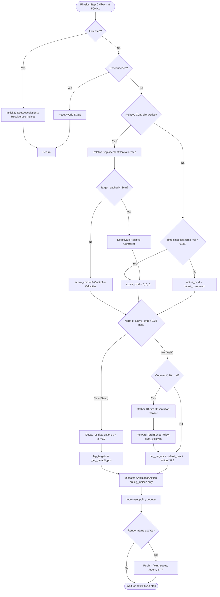
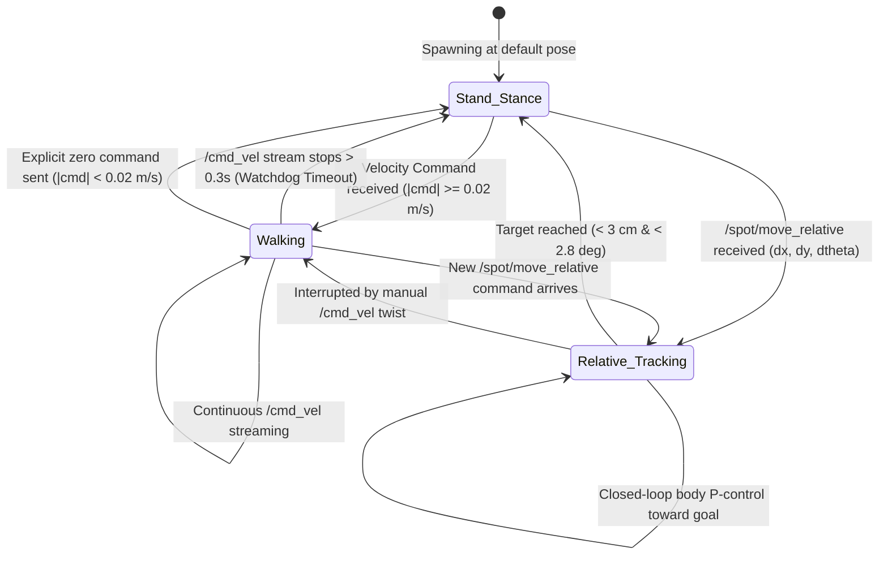

# Comprehensive System Architecture, Logic, and Reproduction Manual

This document provides an exhaustive, end-to-end reference for the **Spot Policy Control** framework in NVIDIA Isaac Sim 4.5 with ROS 1 Noetic. It covers the full architectural design, state machines, control logic, and a 100% reproducible step-by-step runbook with explicit **[HOST]** vs. **[DOCKER]** instructions.

---

## 1. System Architecture

```
+---------------------------------------------------------------------------------------------------+
|                                      HOST SYSTEM (Linux: pringles)                                |
|                                                                                                   |
|  +---------------------------------------------------------------------------------------------+  |
|  | Isaac Sim 4.5 Process (python.sh spot_ros_controller.py)                                    |  |
|  |                                                                                             |  |
|  |  [ROS 1 Bridge: isaacsim.ros1.bridge]                                                       |  |
|  |  +---------------------------------------------------------------------------------------+  |  |
|  |  | Subscriptions: /cmd_vel (Twist), /spot/move_relative (Pose2D)                            |  |  |
|  |  | Publications:  /joint_states (JointState), /odom (Odometry), /tf (TransformStamped)     |  |  |
|  |  +-------------------------------------------+-------------------------------------------+  |  |
|  |                                              | active velocity command [vx, vy, wz]          |  |
|  |                                              v                                               |  |
|  |  +---------------------------------------------------------------------------------------+  |  |
|  |  | RelativeDisplacementController (Closed-Loop Base Tracker)                             |  |  |
|  |  | - Converts local (dx, dy, dtheta) into global world target coordinates                  |  |  |
|  |  | - Computes proportional body velocities to drive Spot towards target                    |  |  |
|  |  | - Automatically stops when within 3 cm / 2.8 deg of target                              |  |  |
|  |  +-------------------------------------------+-------------------------------------------+  |  |
|  |                                              | active command [vx, vy, wz]                   |  |
|  |                                              v                                               |  |
|  |  +---------------------------------------------------------------------------------------+  |  |
|  |  | SpotArmSafePolicyController                                                           |  |  |
|  |  | - Evaluates neural network policy (spot_policy.pt) at 50 Hz                           |  |  |
|  |  | - Filters observation & action tensors strictly by 12 leg DOF indices                 |  |  |
|  |  | - Stance Lock: If |cmd| < 0.02 m/s, decays actions & holds default standing posture   |  |  |
|  |  +-------------------------------------------+-------------------------------------------+  |  |
|  |                                              | 12 Leg Joint Targets (ArticulationAction)     |  |
|  |                                              v                                               |  |
|  |  +---------------------------------------------------------------------------------------+  |  |
|  |  | PhysX 500 Hz Articulation Simulation (/World/Spot)                                    |  |  |
|  |  | - Base Body (/World/Spot/body) ready for OpenManipulator arm attachment                 |  |  |
|  |  | - 12 Leg Joints: fl_hx/hy/kn, fr_hx/hy/kn, hl_hx/hy/kn, hr_hx/hy/kn                   |  |  |
|  |  +---------------------------------------------------------------------------------------+  |  |
|  +----------------------------------------------+----------------------------------------------+  |
+-------------------------------------------------|-------------------------------------------------+
                                                  |
                         Shared Host Networking   | ROS Master URI: http://localhost:11311
                                                  v
+---------------------------------------------------------------------------------------------------+
|                                  DOCKER CONTAINER: ros_noetic                                     |
|                                                                                                   |
|  - roscore & ROS Master                                                                           |
|  - Teleoperation node (spot_teleop.py)                                                            |
|  - Relative movement CLI client (spot_move_relative.py)                                           |
|  - Catkin workspace: /root/ws_moveit (bind-mounted from /home/user/monisi1/ws_moveit_clean)        |
|  - Future: MoveIt arm trajectory execution (trajectory_bridge.py / move_group)                    |
+---------------------------------------------------------------------------------------------------+
```

---

## 2. Logic & Control Flowcharts

### 2.1 Physics & Locomotion Step Flowchart



---

### 2.2 Command Arbitrator & Stance Lock State Machine



---

## 3. Mathematical & Control Formulations

### 3.1 Neural Network Observation Vector (Dimension 48)
The policy network expects a 48-dimensional float tensor evaluated at $50\text{ Hz}$ ($500\text{ Hz}$ simulation with decimation $= 10$):

$$\mathbf{o} = [\mathbf{v}_b, \boldsymbol{\omega}_b, \mathbf{g}_b, \mathbf{c}, \Delta\mathbf{q}, \dot{\mathbf{q}}, \mathbf{a}_{\text{prev}}]^T \in \mathbb{R}^{48}$$

| Slice | Dimension | Description | Calculation |
|---|---|---|---|
| `obs[0:3]` | 3 | Base linear velocity in body frame | $\mathbf{v}_b = \mathbf{R}_{IB}^T \mathbf{v}_I$ |
| `obs[3:6]` | 3 | Base angular velocity in body frame | $\boldsymbol{\omega}_b = \mathbf{R}_{IB}^T \boldsymbol{\omega}_I$ |
| `obs[6:9]` | 3 | Projected gravity unit vector | $\mathbf{g}_b = \mathbf{R}_{IB}^T [0, 0, -1]^T$ |
| `obs[9:12]` | 3 | Commanded base velocity | $[v_x, v_y, \omega_z]^T$ (clamped to limits) |
| `obs[12:24]` | 12 | Leg joint positions relative to default | $\mathbf{q}_{\text{leg}} - \mathbf{q}_{\text{default}}$ |
| `obs[24:36]` | 12 | Leg joint velocities | $\dot{\mathbf{q}}_{\text{leg}}$ |
| `obs[36:48]` | 12 | Previous policy action vector | $\mathbf{a}_{\text{prev}}$ |

### 3.2 Joint Action Dispatching
The network outputs a 12-dimensional action vector $\mathbf{a} \in \mathbb{R}^{12}$. Joint position targets are computed as:

$$\mathbf{q}_{\text{target}} = \mathbf{q}_{\text{default}} + 0.2 \cdot \mathbf{a}$$

To prevent shape mismatch when an arm is mounted, targets are applied strictly to the leg DOF indices:
```python
ArticulationAction(joint_positions=leg_targets, joint_indices=self._leg_dof_indices)
```

### 3.3 Zero-Velocity Stance Lock (Deadband Decay)
When $\|\mathbf{c}\| < 0.02\text{ m/s}$, the stance lock activates to eliminate residual neural network limit cycles:

$$\mathbf{a}_{k+1} = 0.9 \cdot \mathbf{a}_k$$

$$\text{If } \max(|\mathbf{a}_{k+1}|) < 0.01 \implies \mathbf{a} = \mathbf{0}, \quad \mathbf{q}_{\text{target}} = \mathbf{q}_{\text{default}}$$

### 3.4 Closed-Loop Relative Displacement Controller
Given a local body offset command $(\Delta x_{\text{body}}, \Delta y_{\text{body}}, \Delta\theta)$:
1. Transform body offset into global world coordinates using initial base yaw $\psi_0$:
   $$\begin{bmatrix} x_{\text{goal}} \\ y_{\text{goal}} \end{bmatrix} = \begin{bmatrix} x_0 \\ y_0 \end{bmatrix} + \begin{bmatrix} \cos\psi_0 & -\sin\psi_0 \\ \sin\psi_0 & \cos\psi_0 \end{bmatrix} \begin{bmatrix} \Delta x_{\text{body}} \\ \Delta y_{\text{body}} \end{bmatrix}$$
   $$\psi_{\text{goal}} = \text{WrapToPi}(\psi_0 + \Delta\theta)$$
2. At every control step with current base pose $(x, y, \psi)$:
   $$\mathbf{e}_{\text{world}} = \begin{bmatrix} x_{\text{goal}} - x \\ y_{\text{goal}} - y \end{bmatrix}, \quad d = \|\mathbf{e}_{\text{world}}\|$$
   $$\begin{bmatrix} e_x \\ e_y \end{bmatrix} = \begin{bmatrix} \cos\psi & \sin\psi \\ -\sin\psi & \cos\psi \end{bmatrix} \mathbf{e}_{\text{world}}, \quad e_\psi = \text{WrapToPi}(\psi_{\text{goal}} - \psi)$$
3. Proportional velocity commands:
   $$v_x = \text{clip}(k_p \cdot e_x, -v_{\max}, v_{\max}), \quad v_y = \text{clip}(k_p \cdot e_y, -v_{\max}, v_{\max})$$
   $$\omega_z = \text{clip}(k_\psi \cdot e_\psi, -\omega_{\max}, \omega_{\max})$$
4. Termination threshold:
   $$\text{Finished if } d \le 0.03\text{ m } (3\text{ cm}) \text{ and } |e_\psi| \le 0.05\text{ rad } (2.8^\circ)$$

---

## 4. Step-by-Step Reproduction Runbook

Follow these exact steps to reproduce the system on any session. Every step is explicitly marked as **[HOST]** or **[DOCKER]**.

### Step 1: Start Docker Container & Verify ROS Master
Run on the **HOST** machine:
```bash
# [HOST] Start the ros_noetic container
docker start ros_noetic

# [HOST] Verify ROS master is online and reachable
docker exec -it ros_noetic bash -c "source /opt/ros/noetic/setup.bash && rostopic list"
```
*Expected Output:*
```
/rosout
/rosout_agg
```

---

### Step 2: Build the Catkin Package in Docker
Run inside the **DOCKER** container (or via `docker exec` from host):
```bash
# [DOCKER] Run build inside container
docker exec -it ros_noetic bash -c "source /opt/ros/noetic/setup.bash && cd /root/ws_moveit && catkin build spot_policy_control"
```
*Expected Output:*
```
[build] Summary: All 1 packages succeeded!
```

---

### Step 3: Launch Spot Simulation in Isaac Sim
Run on the **HOST** machine:
```bash
# [HOST] Run Spot policy controller in Isaac Sim
/home/user/monisi1/isaacsim/python.sh /home/user/monisi1/ws_moveit_clean/src/spot_policy_control/scripts/spot_ros_controller.py
```
> [!NOTE]
> - If running over an SSH terminal without an active monitor or Vulkan display, append `--headless`:
>   ```bash
>   /home/user/monisi1/isaacsim/python.sh /home/user/monisi1/ws_moveit_clean/src/spot_policy_control/scripts/spot_ros_controller.py --headless
>   ```
> - On first launch, Isaac Sim caches assets from the Nucleus/AWS server, which takes ~30–60 seconds.

---

### Step 4: Verify Active ROS Topics
In a separate terminal on the **HOST** or inside **DOCKER**:
```bash
# [DOCKER] Verify active topics
docker exec -it ros_noetic bash -c "source /opt/ros/noetic/setup.bash && rostopic list"
```
*Expected Topics:*
```
/cmd_vel
/joint_states
/odom
/rosout
/rosout_agg
/spot/move_relative
/tf
```

Check joint state stream:
```bash
# [DOCKER] Echo joint states (1 message)
docker exec -it ros_noetic bash -c "source /opt/ros/noetic/setup.bash && rostopic echo /joint_states -n 1"
```
*Verify that all 12 Spot leg joints are publishing position and velocity data.*

---

### Step 5: Test Relative Distance Commands
Command Spot to move by exact metric distances using the CLI tool:

```bash
# [HOST or DOCKER] Move front by 0.5 m:
python3 /home/user/monisi1/ws_moveit_clean/src/spot_policy_control/scripts/spot_move_relative.py --forward 0.5

# [HOST or DOCKER] Move left by 0.3 m:
python3 /home/user/monisi1/ws_moveit_clean/src/spot_policy_control/scripts/spot_move_relative.py --left 0.3

# [HOST or DOCKER] Move front 0.5 m AND left 0.3 m at the same time:
python3 /home/user/monisi1/ws_moveit_clean/src/spot_policy_control/scripts/spot_move_relative.py --forward 0.5 --left 0.3

# [HOST or DOCKER] Turn 90 degrees counter-clockwise:
python3 /home/user/monisi1/ws_moveit_clean/src/spot_policy_control/scripts/spot_move_relative.py --turn 90
```

Alternatively, publish via `rostopic`:
```bash
# [DOCKER] Move front 0.5 m via rostopic:
docker exec -it ros_noetic bash -c "source /opt/ros/noetic/setup.bash && rostopic pub -1 /spot/move_relative geometry_msgs/Pose2D '{x: 0.5, y: 0.0, theta: 0.0}'"
```
*Result: Spot trots to the target position, decelerates smoothly as it nears the goal, and locks into the standing stance when reached.*

---

### Step 6: Test Continuous Velocity Control & Watchdog Auto-Stop

#### Method A: Keyboard Teleoperation
Run in an interactive terminal:
```bash
# [HOST or DOCKER] Launch interactive teleop:
python3 /home/user/monisi1/ws_moveit_clean/src/spot_policy_control/scripts/spot_teleop.py
```
- Press `w` to trot forward.
- Press `x` to trot backward.
- Press `a` / `d` to strafe left / right.
- Press `q` / `e` to rotate counter-clockwise / clockwise.
- Press `SPACE` or `Ctrl+C` to stop immediately.

#### Method B: Direct Topic Stream & Watchdog Verification
```bash
# [DOCKER] Stream velocity command at 10 Hz:
docker exec -it ros_noetic bash -c "source /opt/ros/noetic/setup.bash && rostopic pub -r 10 /cmd_vel geometry_msgs/Twist '{linear: {x: 0.5, y: 0.0, z: 0.0}, angular: {x: 0.0, y: 0.0, z: 0.0}}'"
```
- Spot will trot forward at $0.5\text{ m/s}$ as long as this command runs.
- **Press `Ctrl+C` in that terminal.**
- **Verification**: Within **0.3 seconds**, the watchdog triggers, the Isaac Sim terminal logs `[SpotRosBridge] Command stream stopped. Watchdog active: Spot safely stopped and standing.`, and Spot stops completely.

---

## 5. Troubleshooting & FAQ

| Symptom | Root Cause | Solution |
|---|---|---|
| `SyntaxError: invalid syntax` on `echo "There was an error running python"` | `/home/user/monisi1/isaacsim/python.sh` was typed twice in the shell command. | Run `/home/user/monisi1/isaacsim/python.sh <script.py>` (enter `python.sh` only once). |
| `Fatal Python error: Segmentation fault` at `setting_model.py:120` | Explicit `"width"` and `"height"` passed into `SimulationApp(...)`. | Only pass `{"headless": args.headless}` to `SimulationApp`. Purge cache: `rm -rf ~/.cache/ov/Kit/106.5`. |
| `ROS Master (roscore) is not online!` | The Docker container `ros_noetic` is not running. | Run `docker start ros_noetic`. |
| Spot moves indefinitely after sending a command | Watchdog was disabled or stance lock was inactive. | Now fixed by default in `SpotArmSafePolicyController` (stance lock at $|v| < 0.02$) and `spot_ros_controller.py` (watchdog default $0.3\text{s}$). |
| `NameError: name 'Tuple' is not defined` | Missing `from typing import Tuple` import. | Fixed: `Tuple, Optional, List` imported from `typing`. |
